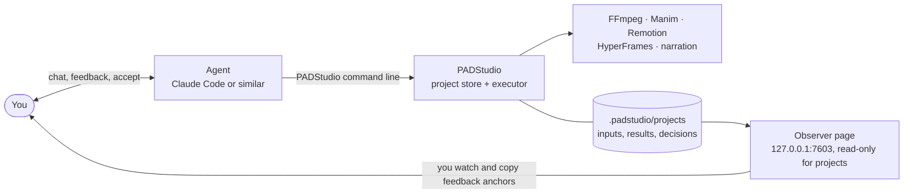

<p align="center"></p>

<h1 align="center">PADStudio</h1>
<p align="center"><strong>Precise Animated Demonstration Studio</strong><br />A video studio that runs on your machine, led by an AI Agent.</p>

<p align="center"><a href="README.md">Tiếng Việt</a> · <a href="CONTRIBUTING.md#english-summary">Contributing</a> · <a href="CHANGELOG.md">Changelog</a></p>

<p align="center"></p>

> **Language note.** PADStudio's documentation and its interface are written in Vietnamese, and its narration, transcription and quality
> checks are tuned for Vietnamese. This page is a short English guide to what it is and how to get it running; the in-depth guides are
> in Vietnamese.

## What it is

You tell an Agent (for example [Claude Code](https://claude.com/claude-code)) what you want, such as *"Make a 2-minute vertical video that
explains Dijkstra's algorithm to beginners, narrated in Vietnamese."* The Agent writes the script, builds the animation, makes the voice-over,
assembles and exports the video. **PADStudio is the foundation that makes this dependable**: it stores every project, runs the tools
(FFmpeg, Manim, Remotion, HyperFrames, text-to-speech), and keeps each input, result, decision and piece of feedback, so a project can be
reopened and continued even when the Agent session changes.

- **The Agent works, you decide.** There is no fixed pipeline. You watch, give feedback in the conversation, and "accept" when you are happy.
- **Everything is traceable.** Every file records its source, rights, the tool that made it and a checksum. The accepted video is delivered byte for byte.
- **Local.** Data stays in the project folder. Anything that costs money (for example ElevenLabs narration) is asked about first and can be capped.

## What it can make

Best at **animated explainer videos** (algorithms, maths, science, technology) of 1 to 3 minutes in vertical 9:16, landscape 16:9 or square,
with narration and subtitles. Also: editing existing footage (cut, join, summarize, subtitles, music, automatic transcription and scene
detection), image-to-video, title cards and charts, short social videos and product demos in five built-in styles.

Animation is built with **Manim** (formulas, geometry), **Remotion** (kinetic text, UI, charts) or **HyperFrames** (frame-exact HTML/CSS).
Narration uses **Piper** (free, local) or **ElevenLabs** (paid; voice and model are chosen on the web page).

## How it works



The Agent is the only channel for commands. PADStudio has no chat of its own. The local web page lets you watch videos, download the
accepted one, browse projects, and edit machine settings (API keys, voice) on the **Tools** page; it never writes to a project.

## Quick start

**Requirements:** Windows 10/11, [Node.js](https://nodejs.org) 20+, [FFmpeg](https://ffmpeg.org) with `ffprobe` on `PATH`, and an Agent that can
run commands in the project folder. No `npm install` is needed: PADStudio has no npm dependencies.

```powershell
git clone https://github.com/padduwcs/PADStudio.git
cd PADStudio
npm run padstudio:doctor        # check your machine
npm run observer:ensure         # open the observer at http://127.0.0.1:7603
```

Then start your Agent **inside this folder** (Claude Code: `claude`). It reads [`AGENTS.md`](AGENTS.md) by itself and knows how to operate PADStudio.
Ask for what you want; watch the result on the observer page; say "accept" (in Vietnamese: "chốt") when you are happy.

### Optional runtimes

FFmpeg alone is enough to edit, join, subtitle and export. For animation, narration and footage analysis, install the optional runtimes
following [`docs/CAI-DAT-RUNTIME.md`](docs/CAI-DAT-RUNTIME.md) (Vietnamese, but every command is copy-and-paste; versions are pinned and
downloads are checksum-verified):

| You want | You need |
| --- | --- |
| Remotion / HyperFrames animation | pinned npm packages, plus Chrome Headless Shell for Remotion |
| Manim animation | Python 3.12 + `manim` |
| Free local narration | Piper + a Vietnamese voice model |
| Scene detection and transcription of footage | Python 3.12 + Whisper models (~5 GB) |
| ElevenLabs narration | just an API key, pasted on the **Tools** page |

PADStudio never installs these by itself. The **Tools** page shows what is ready and how to enable what is missing.

## Status and limits

Version **0.1**, in active development.

- Tested on **Windows only**; macOS and Linux have not been tried.
- **Vietnamese first**: narration, transcription and quality checks are tuned for it.
- Automated checks catch technical faults; they do not judge creative quality. You still watch and listen.
- The ElevenLabs voice picker has so far been tested against a fake ElevenLabs only, not a real account.
- **Animation code written by the Agent runs on your machine without a sandbox.** See [`SECURITY.md`](SECURITY.md) (Vietnamese; the
  short version: the observer listens on localhost only, API keys live in a git-ignored `padstudio.local.json`, and generated code is not isolated).
- There is no official release yet; use the `main` branch.

## Contributing and license

Contributions are welcome: read [`CONTRIBUTING.md`](CONTRIBUTING.md) (it has an English summary at the end) and run `npm run check` and
`npm test` before opening a pull request. Report vulnerabilities privately, see [`SECURITY.md`](SECURITY.md).

Source code is under the [MIT license](LICENSE), © 2026 Anh-Duc Phan. The Manrope font in `ui/fonts/` is under the SIL Open Font License.
The logo and brand assets in `ui/brand/` belong to the project author; ask before using them elsewhere. External tools (FFmpeg, Manim,
Remotion, HyperFrames, Piper, Whisper, ElevenLabs) have their own licenses and terms, which you accept when you install and use them.
