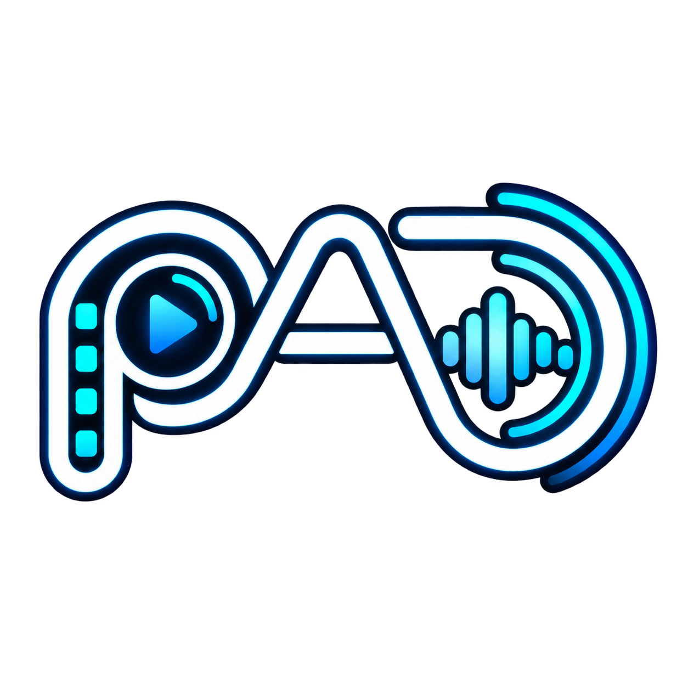
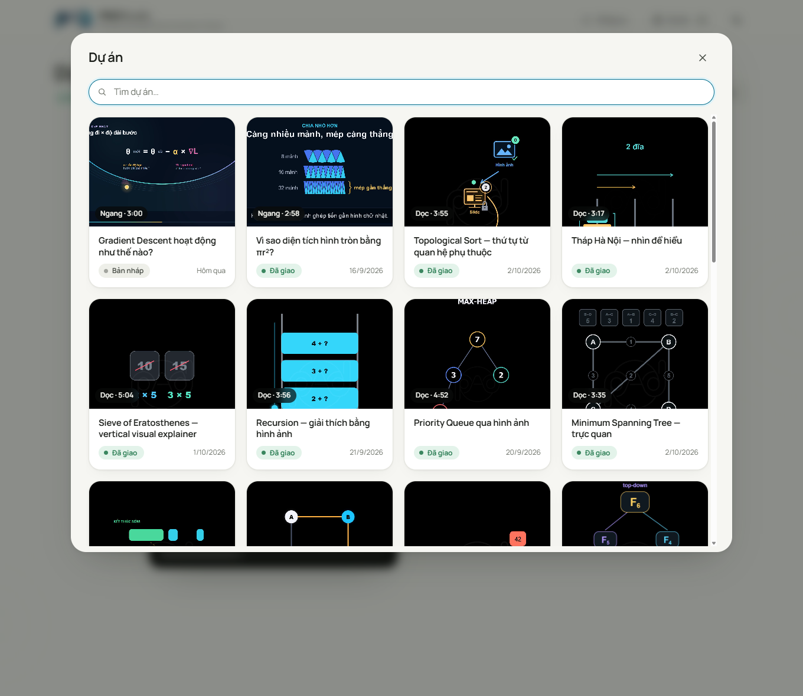
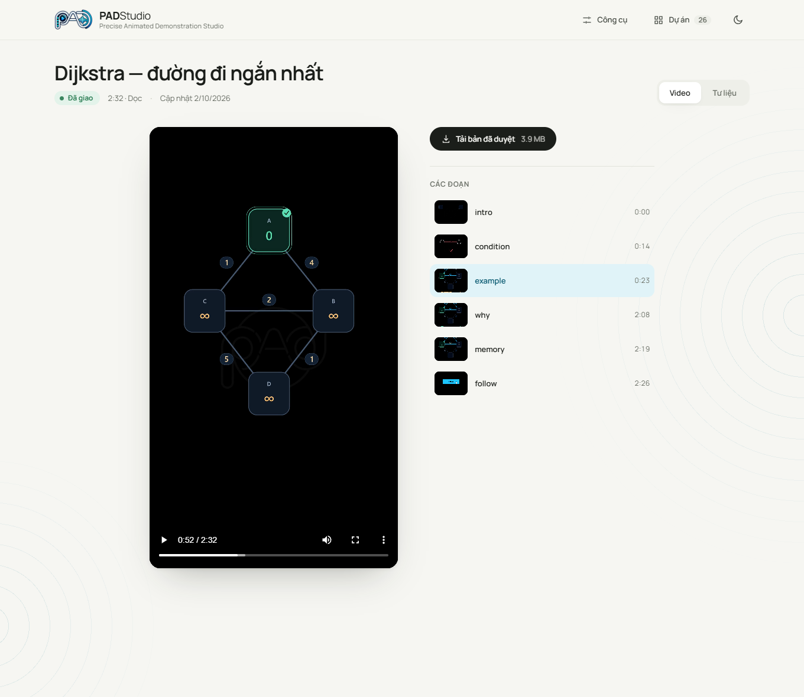
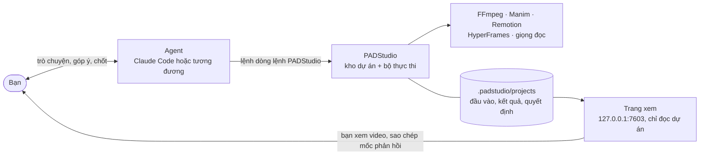
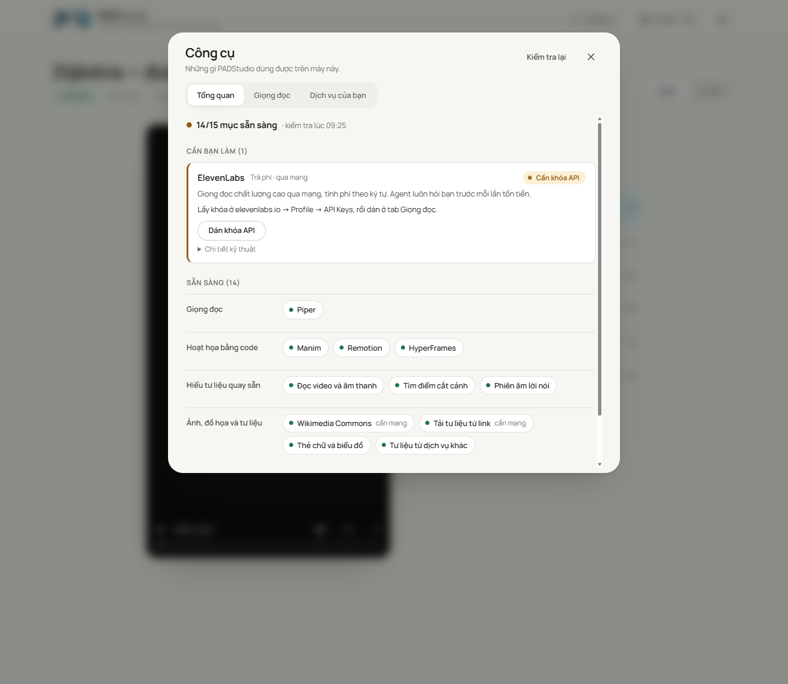

<p align="center"></p>

<h1 align="center">PADStudio</h1>
<p align="center"><strong>Precise Animated Demonstration Studio</strong><br />Xưởng làm video chạy trên máy bạn, do một Agent AI dẫn dắt.</p>

<p align="center">
  <a href="https://github.com/padduwcs/PADStudio/actions/workflows/test.yml"></a>
  <a href="LICENSE"></a>
  
  
  <a href="https://github.com/padduwcs/PADStudio/releases"></a>
</p>

<p align="center"><a href="README.en.md">English</a> · <a href="docs/HUONG-DAN.md">Hướng dẫn sử dụng</a> · <a href="docs/CAI-DAT-RUNTIME.md">Cài đặt runtime</a> · <a href="CHANGELOG.md">Lịch sử thay đổi</a></p>

<p align="center"></p>

## PADStudio là gì

Bạn nói với một Agent (ví dụ [Claude Code](https://claude.com/claude-code)) điều bạn muốn: *"Làm video dọc 2 phút giải thích
thuật toán Dijkstra cho người mới học, giọng đọc tiếng Việt."* Agent viết kịch bản, dựng hoạt họa, tạo giọng đọc, ghép và xuất video.
**PADStudio là phần nền giúp việc đó làm được thật**: nó lưu mọi dự án, chạy công cụ (FFmpeg, Manim, Remotion, HyperFrames, giọng đọc),
và giữ lại từng đầu vào, kết quả, quyết định và phản hồi để dự án luôn mở lại và tiếp tục được, dù Agent đã đổi phiên.

Điểm khác với một "nút bấm tạo video":

- **Agent làm việc, bạn giữ quyền quyết định.** Không có quy trình cố định cho mọi video. Bạn xem, góp ý ngay trong cuộc trò chuyện
  và chỉ "chốt" khi hài lòng.
- **Mọi thứ có dấu vết.** Mỗi file có nguồn, bản quyền, công cụ tạo ra và mã kiểm tra. Bản đã chốt được giao nguyên từng byte.
- **Chạy trên máy bạn.** Dữ liệu ở lại trong thư mục dự án. Chi phí (nếu có, ví dụ giọng đọc ElevenLabs) luôn được hỏi trước và có
  thể đặt trần.

<p align="center"></p>

## Làm được những video nào

Mạnh nhất là **video giải thích bằng hoạt họa** (thuật toán, toán, khoa học, công nghệ) dài 1 đến 3 phút, khung dọc 9:16, ngang 16:9
hoặc vuông, có lời đọc tiếng Việt và phụ đề. Ngoài ra:

- **Dựng từ video quay sẵn:** cắt, ghép, tóm tắt, phụ đề, nhạc nền; tự phiên âm lời nói và tìm điểm cắt cảnh.
- **Video từ ảnh** (zoom, di chuyển nhẹ), thẻ chữ, biểu đồ, sơ đồ các bước.
- **Video ngắn mạng xã hội, demo sản phẩm, phong cách tối giản**, với năm phong cách có sẵn để Agent chọn.

Hoạt họa dựng bằng ba bộ công cụ: **Manim** (công thức, hình học), **Remotion** (chữ động, giao diện, biểu đồ) và **HyperFrames**
(HTML/CSS chính xác từng khung hình). Giọng đọc: **Piper** (miễn phí, trên máy) hoặc **ElevenLabs** (trả phí; chọn giọng và model ngay
trên trang web).

Các dự án trong ảnh trên là video thật đã làm bằng PADStudio (Dijkstra, BFS/DFS, quy hoạch động, Tháp Hà Nội, Gradient Descent…).

## Cách hoạt động



- **Agent** hiểu yêu cầu, chọn việc và công cụ, và là **kênh duy nhất** để ra lệnh.
- **PADStudio** lưu dự án, chạy công cụ và giữ dấu vết. Nó không có chat riêng và không tự quyết định nội dung.
- **Trang xem** (web cục bộ) để xem video, tải bản đã chốt, duyệt dự án, và chỉnh cài đặt máy (khóa API, giọng) ở trang **Công cụ**.
  Nó không bao giờ ghi vào dự án.

## Bắt đầu nhanh

**Yêu cầu:** Windows 10/11, [Node.js](https://nodejs.org) 20 trở lên, [FFmpeg](https://ffmpeg.org) (kèm `ffprobe`) trong `PATH`, và một
Agent có thể chạy lệnh trong thư mục dự án. Không cần `npm install`: PADStudio không có dependency npm.

```powershell
git clone https://github.com/padduwcs/PADStudio.git
cd PADStudio
npm run padstudio:doctor        # kiểm tra máy của bạn
npm run observer:ensure         # mở trang xem tại http://127.0.0.1:7603
```

Rồi mở Agent của bạn **trong thư mục này** (với Claude Code: `claude`). Nó tự đọc [`AGENTS.md`](AGENTS.md) và biết cách vận hành.
Hãy nói điều bạn muốn:

> Làm video dọc 90 giây giải thích vì sao trời có màu xanh, giọng đọc tiếng Việt, cho học sinh cấp 2.

Xem bản dựng ở trang xem. Muốn sửa đúng một chỗ, dừng video ở đó, bấm **Sao chép mốc phản hồi**, dán vào chat và nói bạn muốn đổi gì. Khi
hài lòng, nói "chốt". Hướng dẫn từng bước: [`docs/HUONG-DAN.md`](docs/HUONG-DAN.md).

<p align="center"></p>

### Runtime tùy chọn

FFmpeg đủ để dựng, ghép, phụ đề và xuất video. Muốn hoạt họa, giọng đọc hay phân tích video quay sẵn, cài thêm theo
[`docs/CAI-DAT-RUNTIME.md`](docs/CAI-DAT-RUNTIME.md) (phiên bản được ghim, có checksum):

| Bạn muốn | Cần |
| --- | --- |
| Hoạt họa Remotion / HyperFrames | gói npm đã ghim, và Chrome Headless Shell cho Remotion |
| Hoạt họa Manim | Python 3.12 + `manim` |
| Giọng đọc miễn phí | Piper + model tiếng Việt |
| Cắt cảnh, phiên âm video có sẵn | Python 3.12 + model Whisper (~5 GB) |
| Giọng đọc ElevenLabs | chỉ một khóa API, dán ở trang **Công cụ** |

PADStudio **không bao giờ tự cài** những thứ này. Trang **Công cụ** (nút *Công cụ* ở góc trên) cho thấy cái nào đã sẵn sàng và cách bật cái còn thiếu.

## Trạng thái và giới hạn

PADStudio ở **phiên bản 0.1**, đang phát triển. Hãy biết trước:

- **Chỉ kiểm thử trên Windows.** Logic chọn trình duyệt và đường dẫn runtime hiện viết cho Windows; macOS và Linux chưa được thử.
- **Tiếng Việt là ngôn ngữ chính.** Giọng đọc, phiên âm và kiểm tra chất lượng được chỉnh cho tiếng Việt.
- **Máy không chứng nhận chất lượng sáng tạo.** Kiểm tra tự động bắt lỗi kỹ thuật; hình ảnh và giọng đọc cần bạn xem và nghe.
- **Bộ chọn giọng ElevenLabs mới được thử với ElevenLabs giả**, chưa với tài khoản thật. Nếu bạn gặp sai khác, hãy mở issue.
- **Mã hoạt họa do Agent sinh ra chạy trên máy bạn, không trong sandbox.** Xem [`SECURITY.md`](SECURITY.md).
- [Phiên bản 0.1.0](https://github.com/padduwcs/PADStudio/releases/tag/v0.1.0) là bản **pre-release** đầu tiên; nhánh `main` luôn là bản mới nhất.

## Tài liệu

| | |
| --- | --- |
| [`docs/HUONG-DAN.md`](docs/HUONG-DAN.md) | Hướng dẫn người dùng: làm video, góp ý, chốt, khắc phục sự cố |
| [`docs/CAI-DAT-RUNTIME.md`](docs/CAI-DAT-RUNTIME.md) | Cài Manim, Remotion, HyperFrames, Piper, phân tích video |
| [`docs/OPERATIONS-RUNBOOK.md`](docs/OPERATIONS-RUNBOOK.md) | Vận hành, sao lưu, khôi phục, dọn dung lượng |
| [`PADSTUDIO-AGENT-RUNTIME.md`](PADSTUDIO-AGENT-RUNTIME.md) | Hướng dẫn cho Agent vận hành (đọc đầu tiên) |
| [`PADSTUDIO-AGENT-REFERENCE.md`](PADSTUDIO-AGENT-REFERENCE.md) | Tra cứu lệnh và hợp đồng cho Agent |
| [`docs/build/`](docs/build/README.md) | Thiết kế, định hướng, trạng thái và đặc tả cho người phát triển |
| [`docs/build/PADSTUDIO-DEVELOPMENT-STATUS.md`](docs/build/PADSTUDIO-DEVELOPMENT-STATUS.md) | Trạng thái hiện tại, số liệu kiểm thử và việc còn lại |
| [`PADSTUDIO-REFERENCE.md`](PADSTUDIO-REFERENCE.md) | Tổng quan kỹ thuật đầy đủ (cấu trúc mã, lệnh vận hành) |
| [`ui/brand/README.md`](ui/brand/README.md) | Bộ nhận diện |

## Đóng góp

Rất hoan nghênh. Đọc [`CONTRIBUTING.md`](CONTRIBUTING.md) trước (có phần ranh giới sản phẩm đã chốt) và
[`CODE_OF_CONDUCT.md`](CODE_OF_CONDUCT.md). Lệnh cho người phát triển:

```powershell
npm run check                     # cú pháp, import thừa, link, tên script, đường dẫn trong tài liệu (vài giây)
npm test                          # toàn bộ test (khoảng một phút)
npm run observer:ui:empty-test    # trang xem trên kho trống (cần Chrome hoặc Edge; dùng kho tạm)
npm run observer:ui:live-test     # tiến độ trực tiếp: preview đầu tiên, giữ player
npm run observer:ui:tools-test    # trang Công cụ: lưu khóa, chọn giọng, dịch vụ (kho và cấu hình tạm)
```

Lỗi bảo mật: báo riêng theo [`SECURITY.md`](SECURITY.md).

## Giấy phép

Mã nguồn theo [giấy phép MIT](LICENSE) © 2026 Anh-Duc Phan. Font Manrope trong `ui/fonts/` theo SIL Open Font License
(xem [`ui/fonts/OFL.txt`](ui/fonts/OFL.txt)). Logo và bộ nhận diện trong `ui/brand/` là của tác giả dự án; hãy hỏi trước khi dùng cho
mục đích khác. Các công cụ bên ngoài (FFmpeg, Manim, Remotion, HyperFrames, Piper, Whisper, ElevenLabs) có giấy phép và điều khoản
riêng; bạn tự cài và chịu trách nhiệm tuân thủ chúng, nhất là khi phân phối video.
