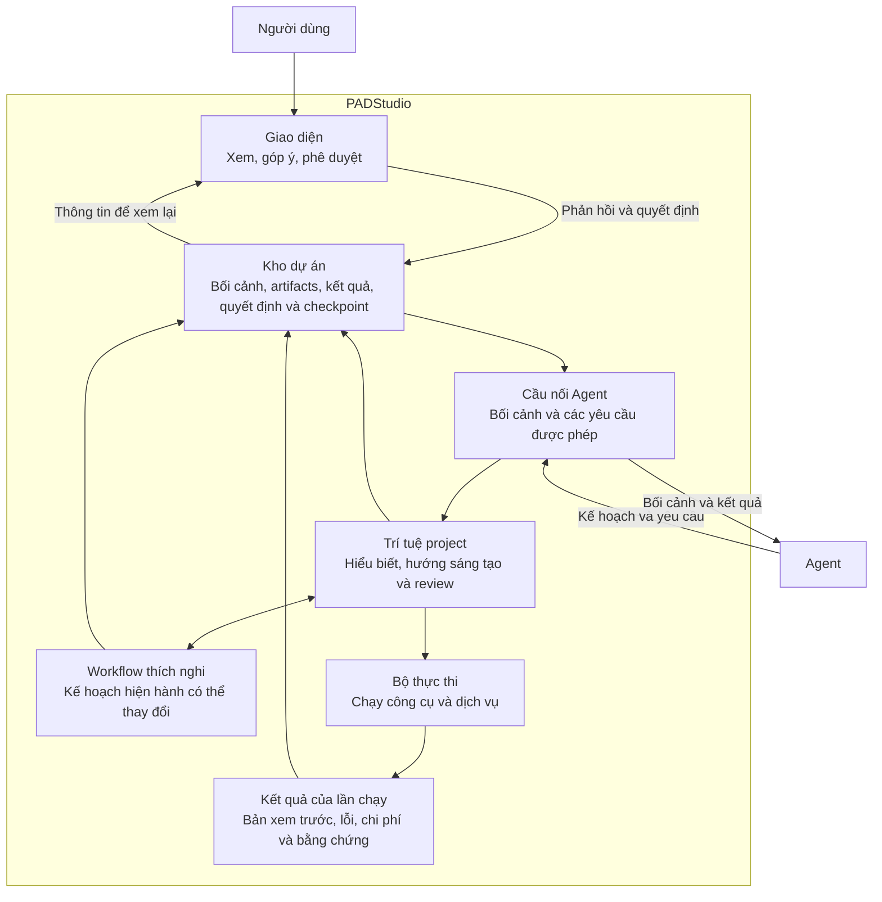
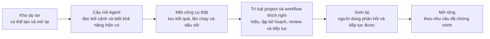

# PADStudio — dàn ý xây dựng hệ thống

Tài liệu này đi sâu hơn [`PADSTUDIO-DESIGN.md`](PADSTUDIO-DESIGN.md). Nó giúp chọn phần cần xây tiếp theo và biết phần đó phải đạt điều gì. Đây vẫn là dàn ý, không phải bản đặc tả kỹ thuật: không có cấu trúc dữ liệu, API, cấu trúc thư mục hay công nghệ bắt buộc.

Mục tiêu là giữ được những gì cần thiết để dự án có thể tiếp tục và kiểm tra lại, nhưng không biến mọi dự án thành một pipeline có các bước cố định.

Trước khi chọn phần cần xây tiếp theo, đọc [`PADSTUDIO-CURRENT-DIRECTION.md`](PADSTUDIO-CURRENT-DIRECTION.md) để biết các định hướng hiện tại đã được chốt. Tài liệu này không thay thế mục tiêu và ranh giới trong bản thiết kế gốc.

## Bản đồ các phần cần xây

Mọi phần đều quay về **kho dự án**. Nhờ vậy người dùng, Agent và giao diện đều hiểu cùng một dự án thay vì mỗi nơi giữ một sự thật riêng.

## 1. Kho dự án

Đây là phần nên xây trước. Mỗi dự án cần có nơi giữ:

- đầu vào ban đầu và yêu cầu mới;
- các kết quả có ý nghĩa, bản được chọn và bản xem trước;
- quyết định, phản hồi và lịch sử các lần chạy;
- checkpoint tại những điểm có ý nghĩa để dự án có thể tiếp tục;
- liên hệ giữa một kết quả với đầu vào, công cụ và lần chạy đã tạo ra nó.

Khi phần này đủ dùng, đóng ứng dụng rồi mở lại vẫn phải biết dự án đang làm gì, đang giữ kết quả nào và cần làm tiếp điều gì. Cách lưu cụ thể sẽ chọn khi bắt đầu xây.

## 2. Cầu nối Agent

Agent là nơi suy nghĩ và chọn hướng sáng tạo; PADStudio không thay Agent lập kế hoạch. Cầu nối Agent cần làm được bốn việc:

1. Gom bối cảnh dự án thành thông tin Agent có thể đọc: mục tiêu, tư liệu, kết quả hiện có, phản hồi và điều bị giới hạn.
2. Cho Agent biết những khả năng nào hiện có, khả năng nào chưa dùng được và điều kiện quan trọng của chúng, như chi phí hoặc yêu cầu phê duyệt.
3. Cho Agent yêu cầu một việc cụ thể mà hệ thống có thể kiểm soát, ví dụ tạo nội dung, phân tích tư liệu hoặc dựng bản xem trước.
4. Trả kết quả, lỗi và thông tin cần thiết về lại dự án để Agent có thể quyết định bước tiếp theo.

Khi xây phần này, chưa cần cố định giao thức cho mọi Agent. Chỉ cần một Agent có thể đọc một dự án và yêu cầu một việc thật.

## 3. Trí tuệ project và workflow thích nghi

Agent cần nhiều hơn danh sách tool và một checkpoint ngắn để duy trì công việc
xuyên suốt. Project cần giữ được ở mức phù hợp:

- mục tiêu, khán giả, kết quả mong muốn và ràng buộc còn hiệu lực;
- điều Agent đã hiểu từ tư liệu và điều vẫn chưa chắc chắn;
- hướng sáng tạo, điều cần giữ và tiêu chí để đánh giá kết quả;
- kế hoạch làm việc hiện hành, việc đang dở, phụ thuộc và điểm cần người dùng quyết định;
- lý do khi Agent thay đổi một lựa chọn hoặc điều chỉnh kế hoạch.

PADStudio không quy định một chuỗi stage chung cho mọi project. Workflow có thể
được Agent chọn từ mẫu, kết hợp hoặc hình thành theo project, rồi thay đổi khi có
thông tin mới. Dù linh hoạt, workflow phải đủ rõ để người dùng hiểu Agent đang làm
gì, hệ thống biết cần giữ thông tin nào và một Agent khác có thể tiếp tục.

Instruction hoặc skill cung cấp kiến thức nghề và cách review cho Agent; chúng
không thay thế dữ liệu của project. Artifact giữ kết quả hiểu biết hoặc sáng tạo,
workflow giữ kế hoạch hiện hành, result/run giữ việc đã thực thi, decision giữ
lựa chọn và checkpoint giữ điểm tiếp tục.

Contract đầu tiên của phần này đã được triển khai đầy đủ; xem
[PROJECT-INTELLIGENCE-ADAPTIVE-WORKFLOW.md](./PROJECT-INTELLIGENCE-ADAPTIVE-WORKFLOW.md).
Các extension sau vẫn phải giữ nguyên nguyên tắc không suy ra pipeline cố định.

## 4. Bộ thực thi

Bộ thực thi là lớp chạy công cụ, dịch vụ AI, công cụ dựng video hoặc tiến trình xử lý. Nó cần tách khỏi phần lưu dự án và phần suy nghĩ của Agent.

### Danh mục khả năng

Trước khi Agent gọi công cụ, hệ thống cần có cách cho biết mỗi khả năng dùng để làm gì, hiện có dùng được không và có điều kiện nào đáng chú ý. Ví dụ: yêu cầu cài đặt, giới hạn tài nguyên, chi phí, đầu ra mong đợi, cách kiểm tra và lựa chọn thay thế.

Danh mục này mô tả **khả năng** trước, không buộc phần lõi phải biết một nhà cung cấp cụ thể. Khi một công cụ không dùng được, hệ thống phải nói rõ; chỉ dùng lựa chọn thay thế khi quy tắc đã chọn hoặc người dùng cho phép.

Một lần thực thi tối thiểu cần cho biết:

- việc nào được yêu cầu, mục đích là gì và có được phép chạy hay không;
- đầu vào nào đã dùng;
- thời điểm bắt đầu, kết thúc, bị hủy hoặc gặp lỗi;
- kết quả, bản xem trước và dấu vết liên quan;
- chi phí và thời lượng nếu chúng có ý nghĩa với người dùng.

Khi thêm một công cụ mới, nó đi vào bộ thực thi thay vì làm thay đổi cách dự án hiểu mục tiêu, quyết định hoặc kết quả.

## 5. Kết quả, lần chạy, quyết định và checkpoint

Đây là bốn loại thông tin khác nhau nhưng liên quan chặt chẽ:

| Cần giữ | Để trả lời câu hỏi |
| --- | --- |
| **Kết quả** | Đã tạo ra hoặc chọn được điều gì? |
| **Lần chạy** | Việc đó được làm bằng công cụ nào, với đầu vào nào, thành công hay thất bại ra sao? |
| **Quyết định** | Người dùng hoặc Agent đã giữ, bỏ hay đổi hướng vì lý do gì? |
| **Checkpoint** | Nếu dừng ở đây, cần biết gì để mở lại và tiếp tục đúng chỗ? |

Checkpoint không phải là một giai đoạn cố định. Nó là ảnh chụp bối cảnh ở một thời điểm có ý nghĩa, chẳng hạn sau khi người dùng chọn một bản hoặc sau một lần chạy lớn.

Một kết quả quan trọng không nên chỉ tồn tại trong cuộc hội thoại hoặc trong bộ nhớ tạm. Dự án cần giữ nó như một phần có thể xem lại.

Mỗi kết quả cần trả lời được các câu hỏi sau ở mức phù hợp với phần đang xây:

- Đây là kết quả gì và dùng để làm gì?
- Nó được tạo từ đầu vào nào và lần chạy nào?
- Có bản xem trước, lỗi, kiểm tra hay giới hạn nào cần xem không?
- Người dùng đã giữ, loại bỏ hay yêu cầu sửa nó?

Không cần tạo một hệ thống kiểm tra phức tạp từ đầu. Bắt đầu bằng bằng chứng cần thiết để người dùng và Agent biết có nên tin, dùng hay làm lại một kết quả hay không.

Trước khi dùng một kết quả cho việc tiếp theo, cần có kiểm tra tối thiểu phù hợp: ví dụ file có tồn tại và mở được, bản xem trước có xem được, hoặc thông tin bắt buộc không bị thiếu. Quy tắc kiểm tra cụ thể sẽ được chọn khi có loại kết quả cụ thể.

## 6. Giao diện cho người dùng

Board là giao diện đầu tiên có thể làm, không phải quy trình bắt buộc. Giao diện cần giúp người dùng:

- thấy dự án đang có những gì và kết quả nào đang được chọn;
- mở bản xem trước, so sánh các bản kết quả và xem lỗi khi có;
- đưa phản hồi, đổi yêu cầu hoặc phê duyệt một kết quả;
- biết trước khi hệ thống chạy việc có chi phí, rủi ro hoặc cần chờ lâu.

Giao diện đọc và ghi thông tin vào kho dự án. Nó không tự giữ một trạng thái chính khác với dự án.

## 7. Vòng chỉnh sửa

Sau mỗi lần tạo kết quả, hệ thống cần hỗ trợ một trong ba hướng: giữ kết quả, sửa cục bộ hoặc đổi hướng. Phản hồi của người dùng phải được ghi vào dự án; Agent dùng bối cảnh mới đó để chọn việc tiếp theo.

Khi chỉ một phần bị ảnh hưởng, phần tốt nên được giữ lại. Ví dụ, thay lời thoại không bắt buộc phải làm lại phần tìm hiểu; thay phong cách hình ảnh không tự động xóa kịch bản đã được chấp nhận.

## 8. Kiểm soát và khả năng khôi phục

Ngay từ lát cắt đầu, hệ thống cần làm rõ những điều có thể gây bất ngờ:

- công cụ nào sẽ chạy, dùng đầu vào nào và có chi phí hay không;
- lỗi, việc dở dang hoặc việc bị hủy được lưu và hiển thị thế nào;
- ai được phép gọi một việc quan trọng;
- khi mở lại dự án, người dùng và Agent có thể tiếp tục từ đâu.

Với việc có chi phí, tác động khó đảo ngược hoặc dùng công cụ mới, phải có quy tắc rõ ràng về việc cần cảnh báo hay xin phê duyệt. Không được tự đổi sang công cụ khác, che lỗi hoặc chi phí đã phát sinh.

Nếu theo dõi chi phí, cần cho biết ước lượng trước khi chạy khi có thể và ghi nhận chi phí thực tế vào lần chạy sau đó. Cách đặt ngân sách hoặc ngưỡng phê duyệt sẽ quyết định khi nhu cầu thực tế xuất hiện.

Mức độ xác thực, phân quyền, hàng đợi hay cơ chế chạy lại chỉ quyết định khi nhu cầu triển khai yêu cầu chúng.

## 9. Thứ tự xây nên ưu tiên

Đây là thứ tự để nhanh có một vòng hoàn chỉnh từ đầu vào đến phản hồi. Không cần xây xong tất cả các phần trong một mục trước khi chuyển sang mục kế tiếp.

## Khi bắt đầu một phần triển khai

Trước khi viết code cho bất kỳ phần nào ở trên, trả lời ngắn sáu câu hỏi:

1. Người dùng hoặc Agent sẽ làm được việc gì mới?
2. Thông tin hoặc kết quả nào phải còn lại sau khi đóng dự án?
3. Phần nào được phép thay đổi, phần nào phải giữ nguyên?
4. Lỗi, chi phí hoặc rủi ro nào cần thấy rõ?
5. Làm sao kiểm tra phần này đã hoạt động?
6. Phần này tạo hoặc thay đổi kết quả, lần chạy, quyết định hay checkpoint nào?

Sau đó đọc [`DEVELOPMENT-PROTOCOL.md`](DEVELOPMENT-PROTOCOL.md) trước khi triển khai.

## Cố ý chưa quyết định

Cơ sở dữ liệu, cấu trúc dữ liệu, API, sự kiện, trạng thái, hàng đợi, mô hình AI, nhà cung cấp dịch vụ, công cụ dựng video, cách chia thành phần hệ thống và cấu trúc thư mục đều là quyết định của từng lát cắt triển khai. Chúng không được suy ra chỉ từ dàn ý này.

Đặc biệt, dàn ý này không quy định tên loại kết quả cố định, danh sách giai đoạn,
checkpoint theo từng giai đoạn hay quy trình bắt buộc cho mọi dự án. Workflow mẫu
có thể được thêm khi nhu cầu thực tế chứng minh giá trị của chúng, nhưng chúng là
điểm khởi đầu có thể thích nghi chứ không phải đường duy nhất Agent được phép đi.
