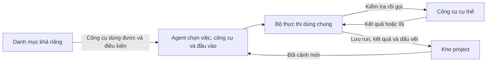

# PADStudio — định hướng hiện tại

Tài liệu này ghi các định hướng đã chốt để làm rõ [`PADSTUDIO-DESIGN.md`](./PADSTUDIO-DESIGN.md); không thay thế bản thiết kế gốc.

## Một UI, một project

PADStudio là nơi người dùng và Agent cùng làm video, không ép mọi project theo một pipeline cố định. UI là một ứng dụng duy nhất, chia làm hai vùng cùng làm việc với **một project**:

- **Chat:** người dùng làm việc trực tiếp với Agent thật — nêu mục tiêu, gửi tư liệu, nhận đề xuất, phản hồi và xác nhận. Đây là chat thật, không phải mô phỏng; người dùng làm việc trực tiếp với Agent ngay trong UI.
- **Web:** người dùng quan sát project, trạng thái, tư liệu, kết quả và preview.

Hai vùng cùng đọc từ kho project, là nguồn sự thật chung. Web không giữ trạng thái project riêng cần đồng bộ với chat.

## Chat điều khiển, web quan sát

Chat là kênh duy nhất để điều khiển công việc trong project. Người dùng đưa yêu cầu, thay đổi hướng và phê duyệt qua chat. Agent hiểu phản hồi, chọn việc sáng tạo cần làm tiếp và cập nhật project.

Web chỉ phục vụ xem và điều hướng: mở project khác, xem trạng thái, phát preview hoặc đổi cách xem. Nó không gửi lệnh và không tự thay đổi lựa chọn, quyết định, kết quả hay checkpoint. Khi Agent cần người dùng quyết định, web hiển thị rõ điều đang chờ và bằng chứng cần xem; người dùng phản hồi trong chat.

Tư liệu người dùng upload trực tiếp trong chat được giữ như đầu vào gốc của project. Với path hoặc URL bên ngoài, Agent xem rồi chỉ đưa phần cần thiết vào project. Web chỉ hiển thị các tư liệu đã có trong project; nó không upload, import, xóa hay đổi chúng.

## Agent làm việc, người dùng kiểm soát hướng

Agent phân tích yêu cầu, chọn cách làm, tư liệu và công cụ phù hợp, rồi tạo kết quả. Người dùng quyết định mục tiêu, ràng buộc, hướng thay đổi và điều gì được chấp nhận.

Agent phải hỏi trong chat khi cần quyết định từ người dùng, đồng thời nói rõ lỗi, chi phí, rủi ro hoặc thay đổi quan trọng. Agent không được âm thầm đổi một lựa chọn có ảnh hưởng đáng kể.

## Hệ thống công cụ và Bộ thực thi

PADStudio cung cấp một đường chung để Agent dùng chương trình trên máy, mô hình local và dịch vụ bên ngoài. Agent chọn việc và công cụ; Bộ thực thi chỉ kiểm soát cách yêu cầu đó được chạy và ghi lại.

| Phần | Trách nhiệm |
| --- | --- |
| **Agent** | Hiểu mục tiêu, chọn việc cần làm, công cụ và đầu vào phù hợp. |
| **Danh mục khả năng** | Cho biết khả năng nào hiện có, công cụ nào thực sự dùng được và cần điều kiện gì. Một khả năng có thể có nhiều công cụ hoặc nhà cung cấp. |
| **Bộ thực thi** | Dùng chung cho mọi công cụ: kiểm tra yêu cầu, quyền, chi phí và rủi ro; quản lý run; gọi công cụ; kiểm tra và ghi nhận kết quả hoặc lỗi. Nó không quyết định sáng tạo. |
| **Công cụ** | Giữ logic chuyên môn để gọi một chương trình, mô hình hoặc dịch vụ cụ thể và trả kết quả theo hợp đồng chung. |
| **Kho project** | Giữ đầu vào, kết quả, lỗi, thời lượng, chi phí và bằng chứng cần thiết để xem lại hoặc tiếp tục. |

Mỗi công cụ phải mô tả đủ để Agent gọi đúng và hệ thống kiểm soát được: nó làm gì, có dùng được không, cần đầu vào nào, tạo đầu ra gì, có chi phí/rủi ro nào và kiểm tra kết quả bằng cách nào. Agent lựa chọn dựa trên mục tiêu, chất lượng cần đạt, môi trường thực tế và quyết định của người dùng. PADStudio không âm thầm đổi công cụ, nhà cung cấp hoặc cách làm khi thay đổi đó có ảnh hưởng đáng kể; lựa chọn thay thế chỉ được dùng khi quy tắc đã chốt hoặc người dùng cho phép.

Lát cắt đầu tiên chỉ cần một danh mục khả năng, một Bộ thực thi dùng chung, hợp đồng chung cho công cụ và kết quả, cùng một công cụ thật để chứng minh toàn bộ vòng chạy. Chưa mặc định xây hàng đợi, worker, chạy song song, tự động thử lại hay tự động fallback.

PADStudio học cách tổ chức công cụ và khám phá khả năng từ OpenMontage nhưng không tích hợp hoặc phụ thuộc vào code của họ. Cấu trúc dữ liệu, API, cách đăng ký và công cụ đầu tiên chỉ được chốt khi bắt đầu lát cắt triển khai.

## Media output có vòng đời thuộc project

Lát cắt tiếp theo được chốt là `video.trim`: một tool FFmpeg trong cùng đường
Registry → Bộ thực thi → run/result, không phải một pipeline dựng video. Phạm vi
hiện tại chỉ gồm cắt một đoạn video chính xác; chưa gồm speed, concat, transition
hay timeline.

File do tool tạo nằm trong `outputs/<run-id>/`, nhưng Agent và request không được
chỉ định đường dẫn input/output tùy ý. PADStudio resolve nguồn từ resource hoặc
result đã đăng ký, cấp vùng ghi tạm riêng, kiểm tra output rồi mới đưa file vào vị
trí bền vững và ghi result. Nếu run lỗi trước khi hoàn tất, output của run bị thu
hồi và input không bị sửa.

Result có thể đăng ký `files` và tham chiếu `inputResults`, nhờ đó media đầu ra
được preview hoặc dùng làm nguồn cho tool sau mà không biến một thử nghiệm thành
chuỗi bước bắt buộc. Result cũ không có hai field này vẫn được đọc như danh sách
rỗng. Web tiếp tục chỉ đọc: chỉ phục vụ file đã đăng ký theo result/file id, không
nhận raw path và không chạy tool.

## Trí nhớ project và checkpoint

Project giữ trí nhớ có ý nghĩa để Agent có thể tiếp tục hoặc kiểm tra lại: yêu cầu/ràng buộc còn hiệu lực, tư liệu và kết quả quan trọng, bản được chọn, quyết định/phê duyệt, run, lỗi, bằng chứng và checkpoint. Agent chắt lọc ý nghĩa; hệ thống giữ các bằng chứng khách quan để chúng không chỉ tồn tại trong hội thoại.

Project không lấy full transcript chat hay suy nghĩ nội bộ của Agent làm lõi. Checkpoint không phải bước cố định: nó cho biết project đang ở đâu, điều gì đã chốt, việc nào đang dở hoặc chờ duyệt và Agent nên làm gì tiếp theo.

Lát cắt decision đầu tiên ghi phản hồi rõ ràng của người dùng đối với một result:
chấp nhận, yêu cầu sửa hoặc loại bỏ. Các decision được ghi nối tiếp để giữ lịch sử;
decision mới nhất của result là trạng thái hiện hành. Một decision không tự sửa
result, không tự loại result khác và không tự cập nhật checkpoint. Không bắt buộc
mọi result phải có decision; các kết quả chỉ mang tính bằng chứng kỹ thuật có thể
không cần người dùng lựa chọn.

## Linh hoạt và tiếp tục

Project có thể bắt đầu từ ý tưởng, file, video, ảnh, đường dẫn đến tài nguyên có sẵn hoặc yêu cầu bất kỳ. Khi người dùng đổi hướng, Agent chỉ làm lại phần bị ảnh hưởng và giữ lại phần vẫn còn giá trị.

## Triển khai tạm thời

Trong giai đoạn đầu, chat chưa nằm trong web PADStudio. Người dùng mở project bằng Agent họ đang dùng và chat trong chính cửa sổ Agent đó; Agent đọc và cập nhật project. Web PADStudio là cửa sổ local chỉ quan sát project.

Đây là cách làm tạm thời để không tạo chat client, cơ chế đăng nhập hay connector riêng chỉ nhằm bắt chước Agent host. Mục tiêu UI một ứng dụng chia chat và web vẫn được giữ; chỉ triển khai khi có cách tích hợp phù hợp với Agent host.
