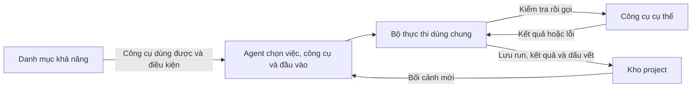

# PADStudio — định hướng hiện tại

Tài liệu này ghi các định hướng đã chốt để làm rõ [`PADSTUDIO-DESIGN.md`](./PADSTUDIO-DESIGN.md); không thay thế bản thiết kế gốc.

## Một UI, một project

PADStudio là nơi người dùng và Agent cùng làm video, không ép mọi project theo một pipeline cố định. UI là một ứng dụng duy nhất, chia làm hai vùng cùng làm việc với **một project**:

- **Chat:** người dùng làm việc trực tiếp với Agent thật — nêu mục tiêu, gửi tư liệu, nhận đề xuất, phản hồi và xác nhận. Đây là chat thật, không phải mô phỏng; người dùng làm việc trực tiếp với Agent ngay trong UI.
- **Web:** người dùng quan sát project, trạng thái, tư liệu, kết quả và preview.

Hai vùng cùng đọc từ kho project, là nguồn sự thật chung. Web không giữ trạng thái project riêng cần đồng bộ với chat.

## Chat điều khiển, web quan sát

Chat là kênh duy nhất để điều khiển công việc trong project. Người dùng đưa yêu cầu, thay đổi hướng và phê duyệt qua chat. Agent hiểu phản hồi, chọn việc sáng tạo cần làm tiếp và cập nhật project.

Web chỉ phục vụ xem và điều hướng: mở project khác, xem trạng thái, phát preview hoặc đổi cách xem. Nó không gửi lệnh và không tự thay đổi lựa chọn, quyết định, kết quả hay checkpoint. Khi Agent cần người dùng quyết định, web hiển thị rõ điều đang chờ và bằng chứng cần xem; người dùng phản hồi trong chat.

Tư liệu người dùng upload trực tiếp trong chat được giữ như đầu vào gốc của project. Với path hoặc URL bên ngoài, Agent xem rồi chỉ đưa phần cần thiết vào project. Web chỉ hiển thị các tư liệu đã có trong project; nó không upload, import, xóa hay đổi chúng.

## Agent làm việc, người dùng kiểm soát hướng

Agent phân tích yêu cầu, chọn cách làm, tư liệu và công cụ phù hợp, rồi tạo kết quả. Người dùng quyết định mục tiêu, ràng buộc, hướng thay đổi và điều gì được chấp nhận.

Agent phải hỏi trong chat khi cần quyết định từ người dùng, đồng thời nói rõ lỗi, chi phí, rủi ro hoặc thay đổi quan trọng. Agent không được âm thầm đổi một lựa chọn có ảnh hưởng đáng kể.

## Bức tranh phát triển: workflow thích nghi do Agent dẫn dắt

PADStudio hướng tới một studio chung nơi người dùng và Agent có thể đi hết vòng
`hiểu → đề xuất → quyết định → thực hiện → xem → phản hồi → tiếp tục`. Agent vẫn
là nơi hiểu project, sáng tạo và chọn việc cần làm; PADStudio giúp sự hiểu biết,
kế hoạch, kết quả và quyết định đó tồn tại bền vững ngoài cuộc hội thoại.

Workflow thích nghi nằm giữa hai cực: để Agent làm hoàn toàn tùy hứng và bắt mọi
project đi qua một pipeline cố định. PADStudio có thể cung cấp workflow mẫu để
Agent chọn, kết hợp hoặc điều chỉnh, nhưng không có một workflow bắt buộc cho mọi
project. Project nhỏ có thể chỉ có vài việc; project phức tạp có thể có nhiều
chặng, phụ thuộc, lần review và điểm phê duyệt.

Workflow hiện hành là một phần của project chứ không chỉ là kế hoạch tạm trong
chat. Agent được thay đổi nó khi có thông tin hoặc phản hồi mới, nhưng thay đổi có
ảnh hưởng đáng kể phải có lý do, giữ dấu vết và xin người dùng quyết định khi liên
quan đến hướng sáng tạo, chi phí, rủi ro hoặc hành động khó đảo ngược. PADStudio
không thay Agent lập kế hoạch và cũng không âm thầm tự chuyển stage.

Contract đầu tiên cho task, phụ thuộc, trạng thái, workflow template, artifact,
review và approval đã được triển khai trong
[PROJECT-INTELLIGENCE-ADAPTIVE-WORKFLOW.md](./PROJECT-INTELLIGENCE-ADAPTIVE-WORKFLOW.md).
Đây là nền móng có version, không phải danh sách stage bắt buộc.

## Học OpenMontage có chọn lọc

PADStudio tiếp tục tham khảo OpenMontage về cách dùng instruction/skill để truyền
kiến thức nghề cho Agent, biến hiểu biết thành artifact có cấu trúc, review theo
mục tiêu sáng tạo, lưu quyết định có lý do và checkpoint để tiếp tục giữa chừng.

PADStudio không sao chép nguyên tắc mọi video phải đi qua một pipeline và danh
sách stage cố định. Những cơ chế học được sẽ là các khối có thể lắp ghép trong
workflow thích nghi. PADStudio cũng giữ cơ chế quản lý input/output thuộc project:
Agent và công cụ không được tùy ý chọn đường dẫn chỉ vì cách đó thuận tiện cho một
tool hay nhà cung cấp cụ thể.

## Trí tuệ project

Để Agent làm việc xuyên suốt, project cần giữ không chỉ việc đã xảy ra mà còn phần
hiểu biết đang có hiệu lực: mục tiêu và ý định của người dùng, điều đã hiểu từ tư
liệu, hướng sáng tạo hiện hành, lựa chọn và lý do, điều chưa chắc chắn, tiêu chí
đánh giá kết quả và ý định tiếp theo.

Phần này không lưu full transcript hoặc suy nghĩ nội bộ. Agent chắt lọc nội dung
có ích thành những thông tin có thể xem lại, thay thế có dấu vết và dùng làm căn
cứ cho công việc tiếp theo. Instruction/skill hướng dẫn Agent cách làm; artifact
giữ kết quả hiểu và sáng tạo; workflow giữ kế hoạch hiện hành; checkpoint chỉ ra
điểm tiếp tục.

## Hệ thống công cụ và Bộ thực thi

PADStudio cung cấp một đường chung để Agent dùng chương trình trên máy, mô hình local và dịch vụ bên ngoài. Agent chọn việc và công cụ; Bộ thực thi chỉ kiểm soát cách yêu cầu đó được chạy và ghi lại.

| Phần | Trách nhiệm |
| --- | --- |
| **Agent** | Hiểu mục tiêu, chọn việc cần làm, công cụ và đầu vào phù hợp. |
| **Danh mục khả năng** | Cho biết khả năng nào hiện có, công cụ nào thực sự dùng được và cần điều kiện gì. Một khả năng có thể có nhiều công cụ hoặc nhà cung cấp. |
| **Bộ thực thi** | Dùng chung cho mọi công cụ: kiểm tra yêu cầu, quyền, chi phí và rủi ro; quản lý run; gọi công cụ; kiểm tra và ghi nhận kết quả hoặc lỗi. Nó không quyết định sáng tạo. |
| **Công cụ** | Giữ logic chuyên môn để gọi một chương trình, mô hình hoặc dịch vụ cụ thể và trả kết quả theo hợp đồng chung. |
| **Kho project** | Giữ đầu vào, kết quả, lỗi, thời lượng, chi phí và bằng chứng cần thiết để xem lại hoặc tiếp tục. |

Mỗi công cụ phải mô tả đủ để Agent gọi đúng và hệ thống kiểm soát được: nó làm gì, có dùng được không, cần đầu vào nào, tạo đầu ra gì, có chi phí/rủi ro nào và kiểm tra kết quả bằng cách nào. Agent lựa chọn dựa trên mục tiêu, chất lượng cần đạt, môi trường thực tế và quyết định của người dùng. PADStudio không âm thầm đổi công cụ, nhà cung cấp hoặc cách làm khi thay đổi đó có ảnh hưởng đáng kể; lựa chọn thay thế chỉ được dùng khi quy tắc đã chốt hoặc người dùng cho phép.

Lát cắt đầu tiên chỉ cần một danh mục khả năng, một Bộ thực thi dùng chung, hợp đồng chung cho công cụ và kết quả, cùng một công cụ thật để chứng minh toàn bộ vòng chạy. Chưa mặc định xây hàng đợi, worker, chạy song song, tự động thử lại hay tự động fallback.

PADStudio không tích hợp hoặc phụ thuộc vào code của OpenMontage. Những cơ chế đã
học và áp dụng gồm artifact có revision, decision có lý do, review có tiêu chí,
checkpoint tiếp tục giữa chừng và skill truyền phương pháp. Pipeline type, stage
cố định và raw output path của OpenMontage không được đưa vào lõi PADStudio.

## Media output có vòng đời thuộc project

Lát cắt đầu tiên được chốt là `video.trim`: một tool FFmpeg trong cùng đường
Registry → Bộ thực thi → run/result, không phải một pipeline dựng video. Cùng
đường đó đã mở rộng thêm `video.concat` (ghép nhiều clip, có transition),
`video.reformat` (đổi tỷ lệ khung hình/độ phân giải), `video.thumbnail` (trích
một khung hình), `audio.overlay` (chèn track âm thanh có sẵn, có ducking),
`subtitle.burn` (ghim phụ đề đã có sẵn văn bản/mốc thời gian) và `image.to-video`
(biến ảnh tĩnh thành video, giữ nguyên khung hình hoặc thêm zoom/pan/Ken Burns
nhẹ theo preset cố định). Mỗi tool vẫn tự chịu trách nhiệm về đúng một
việc rõ ràng; PADStudio chưa có timeline nhiều lớp hay pipeline dựng video cố
định, và sẽ chỉ thêm tool mới khi có việc sáng tạo thật cần đến. Các tool media cũ không cần dịch vụ bên ngoài. Capability `tts.synthesize` nay có
Piper local và ElevenLabs cloud; backend cloud chỉ chạy với authorization credit bind
đúng request và dùng một lần, thay cho cơ chế luôn báo lỗi khi `approvalRequired` bật.

File do tool tạo nằm trong `outputs/<run-id>/`, nhưng Agent và request không được
chỉ định đường dẫn input/output tùy ý. PADStudio resolve nguồn từ resource hoặc
result đã đăng ký, cấp vùng ghi tạm riêng, kiểm tra output rồi mới đưa file vào vị
trí bền vững và ghi result. Nếu run lỗi trước khi hoàn tất, output của run bị thu
hồi và input không bị sửa.

Result có thể đăng ký `files` và tham chiếu `inputResults`, nhờ đó media đầu ra
được preview hoặc dùng làm nguồn cho tool sau mà không biến một thử nghiệm thành
chuỗi bước bắt buộc. Result cũ không có hai field này vẫn được đọc như danh sách
rỗng. Web tiếp tục chỉ đọc: chỉ phục vụ file đã đăng ký theo result/file id, không
nhận raw path và không chạy tool.

Sau khi output đã kiểm tra và Result đã được ghi bền vững, lỗi khi hoàn tất record
Run không được phép xóa Result hoặc file output. Với provider trả phí, nếu response
và output đã được xác minh nhưng bước ghi Result lỗi, Run giữ pending Result draft
cùng output để phục hồi. Context đánh dấu Run đó là đang chờ hoàn tất dấu vết; Agent
dùng lệnh phục hồi để ghi Result, settle authorization còn `claimed` từ provider
receipt và hoàn tất Run mà không chạy lại tool. Rollback chỉ xóa output khi chưa có
Result/pending Result có thể phục hồi và chưa cần bảo toàn output đã trả phí.

## Trí nhớ project và checkpoint

Project giữ trí nhớ có ý nghĩa để Agent có thể tiếp tục hoặc kiểm tra lại: yêu cầu/ràng buộc còn hiệu lực, tư liệu và kết quả quan trọng, bản được chọn, quyết định/phê duyệt, run, lỗi, bằng chứng và checkpoint. Agent chắt lọc ý nghĩa; hệ thống giữ các bằng chứng khách quan để chúng không chỉ tồn tại trong hội thoại.

Project không lấy full transcript chat hay suy nghĩ nội bộ của Agent làm lõi. Checkpoint không phải bước cố định: nó cho biết project đang ở đâu, điều gì đã chốt, việc nào đang dở hoặc chờ duyệt và Agent nên làm gì tiếp theo.

Lát cắt decision đầu tiên ghi phản hồi rõ ràng của người dùng đối với một result:
chấp nhận, yêu cầu sửa hoặc loại bỏ. Các decision được ghi nối tiếp để giữ lịch sử;
decision mới nhất của result là trạng thái hiện hành. Một decision không tự sửa
result, không tự loại result khác và không tự cập nhật checkpoint. Không bắt buộc
mọi result phải có decision; các kết quả chỉ mang tính bằng chứng kỹ thuật có thể
không cần người dùng lựa chọn.

## Linh hoạt và tiếp tục

Project có thể bắt đầu từ ý tưởng, file, video, ảnh, đường dẫn đến tài nguyên có sẵn hoặc yêu cầu bất kỳ. Khi người dùng đổi hướng, Agent chỉ làm lại phần bị ảnh hưởng và giữ lại phần vẫn còn giá trị.

## Phần vừa hoàn thành

Sau kho project, Bộ thực thi, công cụ thật đầu tiên và web observer, PADStudio đã
triển khai **Project Intelligence + Adaptive Workflow** thành một subsystem hoàn
chỉnh. Nó cho phép Agent:

1. chắt lọc và lưu cách hiểu hiện hành về mục tiêu và tư liệu;
2. ghi một hướng sáng tạo đủ để giữ sự nhất quán;
3. đề xuất và lưu kế hoạch làm việc phù hợp với project thay vì dùng chuỗi bước cố định;
4. thực hiện một việc, review kết quả theo cả bằng chứng kỹ thuật và mục tiêu sáng tạo;
5. cập nhật checkpoint để một Agent có thể mở lại và tiếp tục đúng hướng.

Artifact/workflow/review/decision được lưu bền vững và có validation; context có
phần active, capability, skill liên quan và resume view; CLI là đường mutation;
Observer trực quan hóa nhưng vẫn chỉ đọc. Workflow mẫu chỉ là điểm khởi đầu và
mọi lần điều chỉnh workflow đều giữ revision cùng lý do.

## Source Understanding từ vòng đời đến observer đã triển khai

Sau nền đánh giá thực tế của gói A, gói B đã bổ sung contract source identity/timebase,
Result bằng chứng, analysis job có revision, single-writer lease, dependency, cancel,
resume/reconcile và cache có kiểm chứng. Gói C đã nối sáu adapter production cho probe,
scene, frame, audio analysis, ASR và preview vào chính vòng đời này. Mỗi unit vẫn đi qua
Bộ thực thi và tạo Run/Result; job chỉ giữ kế hoạch kỹ thuật và điểm tiếp tục, không thay
workflow sáng tạo.

Gói D đã nối Result vào một reader dùng chung cho CLI, context và observer API. Agent có
thể đọc theo nguồn/Result/range, tìm transcript và assessment, lưu profile/assessment/
transcript correction có revision và bằng chứng đã kiểm tra. Raw analysis vẫn bất biến;
verify riêng phát hiện source/file stale hoặc missing và đưa cảnh báo vào context.

Gói E đã nối reader vào workspace observer chỉ đọc: chọn nguồn/Result set, phát nguồn hoặc
proxy theo source time, xem coverage và lazy-load transcript/scene/frame/audio/assessment,
tìm kiếm index, hiển thị freshness/warning và giữ playback qua polling. UI không đọc JSONL,
không verify hay chạy tool ngầm và không thêm đường mutation.

Runtime thiếu hoặc profile/model không đúng lock trả `blocked`, modality không tồn tại trả
`not_applicable`; không tự tải model, fallback hay gọi harness gói A như production.
Chi tiết: [gói B](./SOURCE-UNDERSTANDING-PACKAGE-B.md) và
[gói C](./SOURCE-UNDERSTANDING-PACKAGE-C.md), [gói D](./SOURCE-UNDERSTANDING-PACKAGE-D.md),
[gói E](./SOURCE-UNDERSTANDING-PACKAGE-E.md).

## Cấu trúc video và vòng sửa đã triển khai

Theo quyết định triển khai tiếp, PADStudio bổ sung artifact `video.sequence`:
các đoạn có ý định, nguồn, thời lượng, lời đọc và phụ đề. Workflow vẫn mô tả
công việc; sequence mô tả sản phẩm, không bắt buộc mọi project phải có sequence.

Renderer đầu tiên là `video.render-sequence` / `ffmpeg-sequence`, local và
không tính phí. Bản dựng gắn với revision chính xác, giữ các đoạn và khung hình
để review; có thể dùng lại đoạn khớp spec và hash. Context báo phụ thuộc đổi
phiên bản; observer cho xem và so sánh. Không tự sửa kế hoạch hay kế thừa approval.
Đây chưa phải timeline nhiều lớp, dịch vụ tạo nội dung hay chat tích hợp.

Chi tiết: [VIDEO-SEQUENCE-PRODUCTION.md](./VIDEO-SEQUENCE-PRODUCTION.md).

## Source Understanding đã nghiệm thu ở phạm vi thực dụng

Gói F đã tổng hợp vòng nghiệm thu fail-closed cho project round-trip, Analysis lifecycle,
cancel/resume/reconcile, runtime/dependency failure, stale/missing/tampered evidence,
pagination/range/nhiều Result set, regression các capability cũ, doctor và browser acceptance.
Kết quả trên máy hiện tại: 129/129 test repository, 20/20 test harness, sáu capability analysis
ready; browser kiểm tra chuyển Result set, 86 transcript rows qua pagination, search, giữ player và
ba viewport.

Đợt 1 được đóng theo phạm vi practical đã chốt ở §18 đặc tả. `releaseDefault` vẫn là `null`;
corpus holdout, ngưỡng ASR/scene, nguồn 2 giờ/4K/VFR/offset và benchmark 100 file/10 giờ vẫn là
`not_measured`, không được mô tả là đã đạt. Chi tiết tại
[SOURCE-UNDERSTANDING-PACKAGE-F.md](./SOURCE-UNDERSTANDING-PACKAGE-F.md).

## Ưu tiên tiếp theo

Đợt 2 — định hướng sáng tạo và duyệt mẫu — đã hoàn thành practical theo
[đặc tả](./CREATIVE-DIRECTION-SPEC.md). Pilot là micro-lesson dọc 30–60 giây từ video bài giảng
được cung cấp. Gói A đã chốt hợp đồng `project.brief`, `creative.proposal`, `creative.direction`,
provenance/revision và tách bước đề xuất khỏi bước người dùng chọn trong workflow mẫu.

Gói B đã khởi tạo pilot thật và chốt direction `keys-first` + takeaway-only. Gói C đã tạo
`video.sequence` 7 đoạn, render mẫu r1, review và sửa cục bộ nhịp nối thành r2; renderer reuse
6/7 đoạn. Người dùng đã duyệt exact r2 dài 47,421 giây; decision bind đúng final Result/review
và workflow đã hoàn tất. Gói D đã bổ sung observer chỉ đọc cho vòng creative/sample; Gói E đã
nghiệm thu round-trip, failure/recovery, freshness và browser. Đợt 3 đã hoàn tất một pilot local
evidence-to-preview có graphic, Piper TTS thật, sequence/render, ASR và kiểm tra mix; không gọi
dịch vụ trả phí. Trạng thái hiện hành và bước tiếp theo nằm trong
[PADSTUDIO-STATE-AND-NEXT.md](./PADSTUDIO-STATE-AND-NEXT.md).
Chi tiết tại [Gói B](./CREATIVE-DIRECTION-PACKAGE-B.md),
[Gói C](./CREATIVE-DIRECTION-PACKAGE-C.md),
[Gói D](./CREATIVE-DIRECTION-PACKAGE-D.md) và
[Gói E](./CREATIVE-DIRECTION-PACKAGE-E.md).

## Triển khai tạm thời

Trong giai đoạn đầu, chat chưa nằm trong web PADStudio. Người dùng mở project bằng Agent họ đang dùng và chat trong chính cửa sổ Agent đó; Agent đọc và cập nhật project. Web PADStudio là cửa sổ local chỉ quan sát project.

Đây là cách làm tạm thời để không tạo chat client, cơ chế đăng nhập hay connector riêng chỉ nhằm bắt chước Agent host. Mục tiêu UI một ứng dụng chia chat và web vẫn được giữ; chỉ triển khai khi có cách tích hợp phù hợp với Agent host.

## Đợt 3 — gói nguyên liệu dùng chung

Theo yêu cầu mở rộng các khả năng phổ biến, gói đầu đã bổ sung `graphic.render`, `audio.prepare`
và `media.acquire` qua Executor hiện có. Gói TTS bổ sung Piper local và ElevenLabs qua cùng
`tts.synthesize`, Result audio dùng lại được và approval credit dùng một lần. Pilot
`phase3-vd04-asset-pilot` đã chứng minh đường local từ nguồn → graphic/Piper → sequence r9 →
render/review; checkpoint hiện current và không có việc treo. Ảnh AI và search stock chưa triển
khai. Đợt 4 đã tiếp tục từ ma sát của pilot này; không mở rộng provider theo số lượng.
Chi tiết trong [ASSET-CAPABILITIES-SPEC.md](./ASSET-CAPABILITIES-SPEC.md),
[TTS-CAPABILITY.md](./TTS-CAPABILITY.md) và
[báo cáo pilot](../../reports/phase3-vd04-pilot-acceptance.json).

## Đợt 4 — composition, 2026-09-12

Theo phạm vi người dùng đã duyệt, sequence 1.1 bổ sung timing/audio, typography,
layer hình, animation preset, transition và music. Web có timeline quan sát/seek,
không có kéo thả mutation. Phiên bản 1.0 được giữ; schema 1.1 không phụ thuộc
filter FFmpeg. Phần được triển khai và giới hạn được ghi trong
[PHASE4-PRODUCTION-SPEC.md](PHASE4-PRODUCTION-SPEC.md). Pilot `pilot-preview` r10 / Result
`result-mty1pb0w-d6598cd6` đã được người dùng duyệt ngày 2026-09-12; approval chỉ áp dụng
cho exact Result này. Đợt 4 đã đóng; phạm vi tiếp theo được chốt là Đợt 5A về polling/payload
observer và phản hồi/so sánh gắn chính xác với Result/revision, không mở provider mới.

## Đợt 5A — observer hiệu quả và phản hồi exact revision, 2026-09-12

Workspace chỉ đọc nay dùng generation/ETag và section summary/source/creative/production/activity; project không đổi nhận 304 rỗng, detail chỉ tải khi tiến gần viewport và polling không thay player. Mỗi render/segment có mốc sao chép gắn project, Result, artifact, revision và time range để phản hồi qua Agent host không lệch phiên bản. Artifact/workflow/review mutation được khóa local; workflow update bắt buộc compare-and-swap bằng `expectedRevision`. Đợt 5A đã hoàn thành practical theo [đặc tả](PHASE5A-OBSERVER-SPEC.md), nhưng chưa đóng toàn bộ Đợt 5. Ưu tiên tiếp theo là Đợt 5B: compact Agent summary, chọn/so sánh exact render Result và lưu feedback segment/time có cấu trúc; không tự mở provider mới hoặc chuyển sớm sang Đợt 6A.

## Đợt 5B — exact Result feedback và Agent resume, 2026-09-12

Vòng phản hồi của Đợt 5 đã khép kín trên Decision hiện hữu. Decision mới cho `video.sequence-render` bắt buộc bind đúng Result và `feedbackTarget` gồm artifact/revision, có thể chỉ rõ segment/time range; store fail-closed khi target lệch và resolution chỉ xảy ra qua `resolvesDecisionIds`. Concurrent decision append/double-resolve dùng project-local lock; primitive lock xử lý contention `EEXIST/EACCES/EPERM` trên Windows.

Full context và summary đưa pending feedback trở lại Agent; summary rút gọn artifact, workflow, capability và analysis pointer nhưng giữ đường đọc detail khi cần. Production observer chọn và so sánh exact render Result thay vì ngầm lấy render cuối, đồng thời đặt feedback đúng Result/segment. Web vẫn chỉ đọc và chat Agent host vẫn là kênh điều khiển.

Acceptance đạt 177/177 repository tests, 20/20 analysis tests và browser 390/768/1440; summary pilot 19.008 byte so với full context 424.516 byte, không còn lock sót. Chi tiết tại [đặc tả 5B](PHASE5B-EXACT-FEEDBACK-SPEC.md) và [report](../../reports/phase5b-feedback-acceptance.json). Đợt 5 đã đóng. Ưu tiên kế tiếp là chốt contract Đợt 6A cho kiểm tra và xuất bản bàn giao của exact Result đã duyệt; chưa mở provider hoặc nền tảng xuất bản mới.
