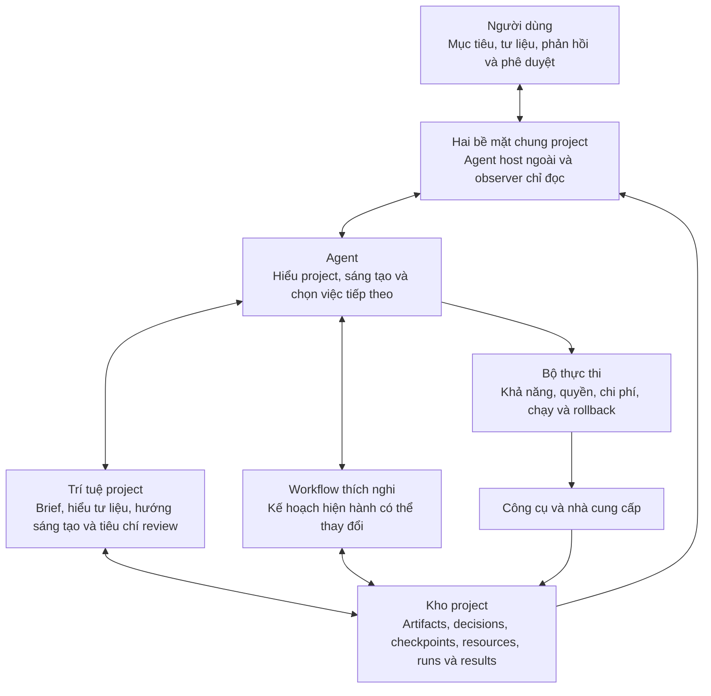
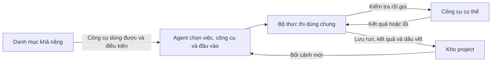

# PADStudio — định hướng hiện tại

Tài liệu này ghi các định hướng đã chốt để làm rõ [`PADSTUDIO-DESIGN.md`](./PADSTUDIO-DESIGN.md); không thay thế bản thiết kế gốc.

> **Cách đọc:** đây là sổ quyết định tích lũy, không phải dashboard trạng thái hay backlog tuyến tính.
> Các mục có ngày giữ nguyên bối cảnh lúc quyết định được ghi; những câu “ưu tiên tiếp theo” bên
> trong mục cũ không còn là chỉ dẫn hiện hành sau khi mốc sau đã được triển khai. Xem
> [`PADSTUDIO-DEVELOPMENT-STATUS.md`](./PADSTUDIO-DEVELOPMENT-STATUS.md) để biết baseline code/test
> gần nhất. Không suy ra sản phẩm đã hoàn chỉnh chỉ từ một mục có chữ “hoàn thành”.

## Agent bên ngoài, một project, observer chỉ đọc

PADStudio là nơi Agent và người dùng cùng làm video mà không ép mọi project theo một pipeline cố định. Kiến trúc sản phẩm đã chốt không xây chat tích hợp:

- **Agent host bên ngoài:** là nơi người dùng chat với Agent thật, đưa mục tiêu, tư liệu, phản hồi và phê duyệt. Agent dùng CLI/contract của PADStudio để đọc và cập nhật project.
- **Web observer:** là cửa sổ local chỉ đọc để quan sát project, trạng thái, tư liệu, kết quả, bằng chứng và preview.

Hai bề mặt cùng dùng kho project làm nguồn sự thật. Observer không giữ trạng thái project riêng và PADStudio không xây chat client, đăng nhập hay connector để bắt chước Agent host.

## Agent host bên ngoài điều khiển, web quan sát

Chat trong Agent host bên ngoài là kênh duy nhất để điều khiển công việc trong project. Người dùng đưa yêu cầu, thay đổi hướng và phê duyệt tại đó. Agent hiểu phản hồi, chọn việc sáng tạo cần làm tiếp và cập nhật project qua CLI/contract.

Web chỉ phục vụ xem và điều hướng: mở project khác, xem trạng thái, phát preview hoặc đổi cách xem. Nó không gửi lệnh và không tự thay đổi lựa chọn, quyết định, kết quả hay checkpoint. Khi Agent cần người dùng quyết định, web hiển thị rõ điều đang chờ và bằng chứng cần xem; người dùng phản hồi trong chat.

Tư liệu người dùng upload trực tiếp trong chat được giữ như đầu vào gốc của project. Với path hoặc URL bên ngoài, Agent xem rồi chỉ đưa phần cần thiết vào project. Web chỉ hiển thị các tư liệu đã có trong project; nó không upload, import, xóa hay đổi chúng.

## Agent làm việc, người dùng kiểm soát hướng

Agent phân tích yêu cầu, chọn cách làm, tư liệu và công cụ phù hợp, rồi tạo kết quả. Người dùng quyết định mục tiêu, ràng buộc, hướng thay đổi và điều gì được chấp nhận.

Agent phải hỏi trong chat khi cần quyết định từ người dùng, đồng thời nói rõ lỗi, chi phí, rủi ro hoặc thay đổi quan trọng. Agent không được âm thầm đổi một lựa chọn có ảnh hưởng đáng kể.

## Bức tranh phát triển: workflow thích nghi do Agent dẫn dắt

PADStudio hướng tới một studio chung nơi người dùng và Agent có thể đi hết vòng
`hiểu → đề xuất → quyết định → thực hiện → xem → phản hồi → tiếp tục`. Agent vẫn
là nơi hiểu project, sáng tạo và chọn việc cần làm; PADStudio giúp sự hiểu biết,
kế hoạch, kết quả và quyết định đó tồn tại bền vững ngoài cuộc hội thoại.

Workflow thích nghi nằm giữa hai cực: để Agent làm hoàn toàn tùy hứng và bắt mọi
project đi qua một pipeline cố định. PADStudio có thể cung cấp workflow mẫu để
Agent chọn, kết hợp hoặc điều chỉnh, nhưng không có một workflow bắt buộc cho mọi
project. Project nhỏ có thể chỉ có vài việc; project phức tạp có thể có nhiều
chặng, phụ thuộc, lần review và điểm phê duyệt.

Workflow hiện hành là một phần của project chứ không chỉ là kế hoạch tạm trong
chat. Agent được thay đổi nó khi có thông tin hoặc phản hồi mới, nhưng thay đổi có
ảnh hưởng đáng kể phải có lý do, giữ dấu vết và xin người dùng quyết định khi liên
quan đến hướng sáng tạo, chi phí, rủi ro hoặc hành động khó đảo ngược. PADStudio
không thay Agent lập kế hoạch và cũng không âm thầm tự chuyển stage.

Contract đầu tiên cho task, phụ thuộc, trạng thái, workflow template, artifact,
review và approval đã được triển khai trong
[PROJECT-INTELLIGENCE-ADAPTIVE-WORKFLOW.md](./PROJECT-INTELLIGENCE-ADAPTIVE-WORKFLOW.md).
Đây là nền móng có version, không phải danh sách stage bắt buộc.

## Học OpenMontage có chọn lọc

PADStudio tiếp tục tham khảo OpenMontage về cách dùng instruction/skill để truyền
kiến thức nghề cho Agent, biến hiểu biết thành artifact có cấu trúc, review theo
mục tiêu sáng tạo, lưu quyết định có lý do và checkpoint để tiếp tục giữa chừng.

PADStudio không sao chép nguyên tắc mọi video phải đi qua một pipeline và danh
sách stage cố định. Những cơ chế học được sẽ là các khối có thể lắp ghép trong
workflow thích nghi. PADStudio cũng giữ cơ chế quản lý input/output thuộc project:
Agent và công cụ không được tùy ý chọn đường dẫn chỉ vì cách đó thuận tiện cho một
tool hay nhà cung cấp cụ thể.

## Trí tuệ project

Để Agent làm việc xuyên suốt, project cần giữ không chỉ việc đã xảy ra mà còn phần
hiểu biết đang có hiệu lực: mục tiêu và ý định của người dùng, điều đã hiểu từ tư
liệu, hướng sáng tạo hiện hành, lựa chọn và lý do, điều chưa chắc chắn, tiêu chí
đánh giá kết quả và ý định tiếp theo.

Phần này không lưu full transcript hoặc suy nghĩ nội bộ. Agent chắt lọc nội dung
có ích thành những thông tin có thể xem lại, thay thế có dấu vết và dùng làm căn
cứ cho công việc tiếp theo. Instruction/skill hướng dẫn Agent cách làm; artifact
giữ kết quả hiểu và sáng tạo; workflow giữ kế hoạch hiện hành; checkpoint chỉ ra
điểm tiếp tục.

## Hệ thống công cụ và Bộ thực thi

### Biên đạo thị giác theo nghĩa — 2026-09-18

PADStudio bổ sung artifact tùy chọn `animation.choreography` cho video giải thích theo lời thoại,
thuật toán, biến đổi và thao tác sản phẩm. Artifact giữ đối tượng có identity, semantic beat, trạng
thái trước/sau, hành động frame-aligned và deliberate hold trước khi Agent viết source. Composition
1.1 bind exact choreography, bắt buộc khớp FPS/thời lượng; Remotion/HyperFrames preview có thể tự lấy
bounded exact frames tại beat/action/hold. Observer cho xem plan và provenance của preflight,
preview/render giữ cả composition lẫn choreography. Composition 1.0 và workflow không dùng nhánh
này vẫn tương thích; đây không phải storyboard hay stage bắt buộc.

Sau pilot Priority Queue, contract 1.1 bổ sung continuity-first planning: visual thesis, persistent
hero objects, causal chapters, exact state inheritance, carried-object continuity, bounded justified
resets và presentation budget cho sân khấu/chữ. Một semantic beat chỉ hợp lệ khi có state-change thật;
entrance/reveal/highlight/hold không còn đủ để chứng minh ý nghĩa. Full-transcript panel bị loại khỏi
choreography 1.1. Observer hiển thị continuity metrics để Agent và người dùng nhận ra kế hoạch đang
tiến triển như một mô hình liên tục hay chỉ là chuỗi mini-slide. Contract 1.0 vẫn đọc được cho project cũ.

Đối chiếu tiếp với toàn bộ thư viện video mẫu cho thấy các ràng buộc toàn cục của 1.1 có thể đẩy Agent
sang cực ngược lại: giữ một dashboard tĩnh và một hero xuyên suốt dù câu hỏi giải thích đã thay đổi.
Contract 1.2 vì vậy giữ kiểm tra semantic state-change nhưng thay continuity hình thức bằng visual
argument do Agent đạo diễn. Mỗi beat nêu câu hỏi thị giác, insight dành cho người xem, quan hệ với phần
trước và ý định bố cục; Agent được chọn carry, transform, reframe, contrast, analogy, cutaway hoặc reset.
Không còn hero quota, state-ID chain, reset budget hay phần trăm sân khấu/chữ cho project mới. Direction
ghi cả opening và đoạn thao tác đại diện cần preview trước khi hoàn thiện timeline dài. Contract 1.0/1.1
vẫn đọc được; observer mô tả lựa chọn của Agent thay vì chấm điểm continuity. Đây vẫn là skill/artifact
tùy chọn, không phải pipeline hay storyboard bắt buộc.

Phản hồi tiếp theo làm rõ ưu tiên **hình ảnh mang nghĩa, chữ chỉ hỗ trợ**. Contract 1.3 giữ toàn bộ
quyền đạo diễn của 1.2 nhưng buộc kế hoạch mới nêu `visualProof` cho từng beat và kiểm kê chính xác
mọi chữ dự kiến xuất hiện theo vai trò/lý do. Chế độ `visual-first` loại full transcript, không cho
annotation làm chủ thể của semantic beat và chặn caption/title/quote bê nguyên lời thoại lên màn hình;
`type-led` vẫn dành cho project mà chữ thực sự là chất liệu thị giác. Observer hiện footprint của chữ
để review, không dùng word count hay phần trăm màn hình làm phán quyết thẩm mỹ. Skill authoring đồng
thời hướng Agent tách scene/passage, primitive và timing/data khi composition đủ lớn, nhưng không lấy
số file làm thước đo chất lượng. Contract 1.0–1.2 vẫn tương thích.

### Mở rộng hoạt họa bằng code — 2026-09-14

PADStudio có nhánh tùy chọn project-native cho Manim Community, Remotion và HyperFrames. Source
và props JSON được lưu thành Result bất biến; ý định/runtime/format/asset/style thành artifact
`animation.composition` có revision; validation, runtime preflight, preview và render đều bind exact
source/props/composition. Remotion có still/clip preview theo frame; HyperFrames có exact-frame snapshot/contact
sheet preview và preflight chuẩn hóa findings, giữ snapshot/crop từ strict check. Preflight của cả ba runtime giữ
diagnostics và full render bắt buộc bind một preflight passed. Render đi
qua Executor và trở thành Result video dùng trực tiếp trong sequence, không tạo pipeline bắt buộc.

Đã học có chọn lọc từ OpenMontage về skill craft tải theo runtime, frame accuracy, managed props/asset
staging, authoring preview và HyperFrames check-before-render. Không lấy raw output path, workspace mutable, auto-`npx`, static denylist như
sandbox, runtime fallback hoặc `final.mp4` semantics. Host execution đi qua exact validation và
preflight do Agent quản lý, không có source-level user approval. Hiện chỉ lọc environment và cô lập workspace; network isolation cấp OS chưa được
cưỡng chế và phải luôn được báo trung thực. Contract: [CODE-ANIMATION-SPEC.md](CODE-ANIMATION-SPEC.md).

PADStudio cung cấp một đường chung để Agent dùng chương trình trên máy, mô hình local và dịch vụ bên ngoài. Agent chọn việc và công cụ; Bộ thực thi chỉ kiểm soát cách yêu cầu đó được chạy và ghi lại.

| Phần | Trách nhiệm |
| --- | --- |
| **Agent** | Hiểu mục tiêu, chọn việc cần làm, công cụ và đầu vào phù hợp. |
| **Danh mục khả năng** | Cho biết khả năng nào hiện có, công cụ nào thực sự dùng được và cần điều kiện gì. Một khả năng có thể có nhiều công cụ hoặc nhà cung cấp. |
| **Bộ thực thi** | Dùng chung cho mọi công cụ: kiểm tra yêu cầu, quyền, chi phí và rủi ro; quản lý run; gọi công cụ; kiểm tra và ghi nhận kết quả hoặc lỗi. Nó không quyết định sáng tạo. |
| **Công cụ** | Giữ logic chuyên môn để gọi một chương trình, mô hình hoặc dịch vụ cụ thể và trả kết quả theo hợp đồng chung. |
| **Kho project** | Giữ đầu vào, kết quả, lỗi, thời lượng, chi phí và bằng chứng cần thiết để xem lại hoặc tiếp tục. |

Mỗi công cụ phải mô tả đủ để Agent gọi đúng và hệ thống kiểm soát được: nó làm gì, có dùng được không, cần đầu vào nào, tạo đầu ra gì, có chi phí/rủi ro nào và kiểm tra kết quả bằng cách nào. Agent lựa chọn dựa trên mục tiêu, chất lượng cần đạt, môi trường thực tế và quyết định của người dùng. PADStudio không âm thầm đổi công cụ, nhà cung cấp hoặc cách làm khi thay đổi đó có ảnh hưởng đáng kể; lựa chọn thay thế chỉ được dùng khi quy tắc đã chốt hoặc người dùng cho phép.

Lát cắt đầu tiên chỉ cần một danh mục khả năng, một Bộ thực thi dùng chung, hợp đồng chung cho công cụ và kết quả, cùng một công cụ thật để chứng minh toàn bộ vòng chạy. Chưa mặc định xây hàng đợi, worker, chạy song song, tự động thử lại hay tự động fallback.

PADStudio không tích hợp hoặc phụ thuộc vào code của OpenMontage. Những cơ chế đã
học và áp dụng gồm artifact có revision, decision có lý do, review có tiêu chí,
checkpoint tiếp tục giữa chừng và skill truyền phương pháp. Pipeline type, stage
cố định và raw output path của OpenMontage không được đưa vào lõi PADStudio.

## Media output có vòng đời thuộc project

Lát cắt đầu tiên được chốt là `video.trim`: một tool FFmpeg trong cùng đường
Registry → Bộ thực thi → run/result, không phải một pipeline dựng video. Cùng
đường đó đã mở rộng thêm `video.concat` (ghép nhiều clip, có transition),
`video.reformat` (đổi tỷ lệ khung hình/độ phân giải), `video.thumbnail` (trích
một khung hình), `audio.overlay` (chèn track âm thanh có sẵn, có ducking),
`subtitle.burn` (ghim phụ đề đã có sẵn văn bản/mốc thời gian) và `image.to-video`
(biến ảnh tĩnh thành video, giữ nguyên khung hình hoặc thêm zoom/pan/Ken Burns
nhẹ theo preset cố định). Mỗi tool vẫn tự chịu trách nhiệm về đúng một
việc rõ ràng; PADStudio chưa có timeline nhiều lớp hay pipeline dựng video cố
định, và sẽ chỉ thêm tool mới khi có việc sáng tạo thật cần đến. Các tool media cũ không cần dịch vụ bên ngoài. Capability `tts.synthesize` nay có
Piper local và ElevenLabs cloud; backend cloud chỉ chạy với authorization credit bind
đúng request và dùng một lần, thay cho cơ chế luôn báo lỗi khi `approvalRequired` bật.

File do tool tạo nằm trong `outputs/<run-id>/`, nhưng Agent và request không được
chỉ định đường dẫn input/output tùy ý. PADStudio resolve nguồn từ resource hoặc
result đã đăng ký, cấp vùng ghi tạm riêng, kiểm tra output rồi mới đưa file vào vị
trí bền vững và ghi result. Nếu run lỗi trước khi hoàn tất, output của run bị thu
hồi và input không bị sửa.

Result có thể đăng ký `files` và tham chiếu `inputResults`, nhờ đó media đầu ra
được preview hoặc dùng làm nguồn cho tool sau mà không biến một thử nghiệm thành
chuỗi bước bắt buộc. Result cũ không có hai field này vẫn được đọc như danh sách
rỗng. Web tiếp tục chỉ đọc: chỉ phục vụ file đã đăng ký theo result/file id, không
nhận raw path và không chạy tool.

Sau khi output đã kiểm tra và Result đã được ghi bền vững, lỗi khi hoàn tất record
Run không được phép xóa Result hoặc file output. Với provider trả phí, nếu response
và output đã được xác minh nhưng bước ghi Result lỗi, Run giữ pending Result draft
cùng output để phục hồi. Context đánh dấu Run đó là đang chờ hoàn tất dấu vết; Agent
dùng lệnh phục hồi để ghi Result, settle authorization còn `claimed` từ provider
receipt và hoàn tất Run mà không chạy lại tool. Rollback chỉ xóa output khi chưa có
Result/pending Result có thể phục hồi và chưa cần bảo toàn output đã trả phí.

## Trí nhớ project và checkpoint

Project giữ trí nhớ có ý nghĩa để Agent có thể tiếp tục hoặc kiểm tra lại: yêu cầu/ràng buộc còn hiệu lực, tư liệu và kết quả quan trọng, bản được chọn, quyết định/phê duyệt, run, lỗi, bằng chứng và checkpoint. Agent chắt lọc ý nghĩa; hệ thống giữ các bằng chứng khách quan để chúng không chỉ tồn tại trong hội thoại.

Project không lấy full transcript chat hay suy nghĩ nội bộ của Agent làm lõi. Checkpoint không phải bước cố định: nó cho biết project đang ở đâu, điều gì đã chốt, việc nào đang dở hoặc chờ duyệt và Agent nên làm gì tiếp theo.

Lát cắt decision đầu tiên ghi phản hồi rõ ràng của người dùng đối với một result:
chấp nhận, yêu cầu sửa hoặc loại bỏ. Các decision được ghi nối tiếp để giữ lịch sử;
decision mới nhất của result là trạng thái hiện hành. Một decision không tự sửa
result, không tự loại result khác và không tự cập nhật checkpoint. Không bắt buộc
mọi result phải có decision; các kết quả chỉ mang tính bằng chứng kỹ thuật có thể
không cần người dùng lựa chọn.

## Linh hoạt và tiếp tục

Project có thể bắt đầu từ ý tưởng, file, video, ảnh, đường dẫn đến tài nguyên có sẵn hoặc yêu cầu bất kỳ. Khi người dùng đổi hướng, Agent chỉ làm lại phần bị ảnh hưởng và giữ lại phần vẫn còn giá trị.

## Phần vừa hoàn thành

Sau kho project, Bộ thực thi, công cụ thật đầu tiên và web observer, PADStudio đã
triển khai **Project Intelligence + Adaptive Workflow** thành một subsystem hoàn
chỉnh. Nó cho phép Agent:

1. chắt lọc và lưu cách hiểu hiện hành về mục tiêu và tư liệu;
2. ghi một hướng sáng tạo đủ để giữ sự nhất quán;
3. đề xuất và lưu kế hoạch làm việc phù hợp với project thay vì dùng chuỗi bước cố định;
4. thực hiện một việc, review kết quả theo cả bằng chứng kỹ thuật và mục tiêu sáng tạo;
5. cập nhật checkpoint để một Agent có thể mở lại và tiếp tục đúng hướng.

Artifact/workflow/review/decision được lưu bền vững và có validation; context có
phần active, capability, skill liên quan và resume view; CLI là đường mutation;
Observer trực quan hóa nhưng vẫn chỉ đọc. Workflow mẫu chỉ là điểm khởi đầu và
mọi lần điều chỉnh workflow đều giữ revision cùng lý do.

## Source Understanding từ vòng đời đến observer đã triển khai

Sau nền đánh giá thực tế của gói A, gói B đã bổ sung contract source identity/timebase,
Result bằng chứng, analysis job có revision, single-writer lease, dependency, cancel,
resume/reconcile và cache có kiểm chứng. Gói C đã nối sáu adapter production cho probe,
scene, frame, audio analysis, ASR và preview vào chính vòng đời này. Mỗi unit vẫn đi qua
Bộ thực thi và tạo Run/Result; job chỉ giữ kế hoạch kỹ thuật và điểm tiếp tục, không thay
workflow sáng tạo.

Gói D đã nối Result vào một reader dùng chung cho CLI, context và observer API. Agent có
thể đọc theo nguồn/Result/range, tìm transcript và assessment, lưu profile/assessment/
transcript correction có revision và bằng chứng đã kiểm tra. Raw analysis vẫn bất biến;
verify riêng phát hiện source/file stale hoặc missing và đưa cảnh báo vào context.

Gói E đã nối reader vào workspace observer chỉ đọc: chọn nguồn/Result set, phát nguồn hoặc
proxy theo source time, xem coverage và lazy-load transcript/scene/frame/audio/assessment,
tìm kiếm index, hiển thị freshness/warning và giữ playback qua polling. UI không đọc JSONL,
không verify hay chạy tool ngầm và không thêm đường mutation.

Runtime thiếu hoặc profile/model không đúng lock trả `blocked`, modality không tồn tại trả
`not_applicable`; không tự tải model, fallback hay gọi harness gói A như production.
Chi tiết: [gói B](./history/SOURCE-UNDERSTANDING-PACKAGE-B.md) và
[gói C](./history/SOURCE-UNDERSTANDING-PACKAGE-C.md), [gói D](./history/SOURCE-UNDERSTANDING-PACKAGE-D.md),
[gói E](./history/SOURCE-UNDERSTANDING-PACKAGE-E.md).

## Cấu trúc video và vòng sửa đã triển khai

Theo quyết định triển khai tiếp, PADStudio bổ sung artifact `video.sequence`:
các đoạn có ý định, nguồn, thời lượng, lời đọc và phụ đề. Workflow vẫn mô tả
công việc; sequence mô tả sản phẩm, không bắt buộc mọi project phải có sequence.

Renderer đầu tiên là `video.render-sequence` / `ffmpeg-sequence`, local và
không tính phí. Bản dựng gắn với revision chính xác, giữ các đoạn và khung hình
để review; có thể dùng lại đoạn khớp spec và hash. Context báo phụ thuộc đổi
phiên bản; observer cho xem và so sánh. Không tự sửa kế hoạch hay kế thừa approval.
Gói ban đầu này chưa bao phủ timeline nhiều lớp hoặc dịch vụ tạo nội dung; chat thuộc Agent host bên ngoài.

Chi tiết: [VIDEO-SEQUENCE-PRODUCTION.md](./VIDEO-SEQUENCE-PRODUCTION.md).

## Source Understanding đã nghiệm thu ở phạm vi thực dụng

Gói F đã tổng hợp vòng nghiệm thu fail-closed cho project round-trip, Analysis lifecycle,
cancel/resume/reconcile, runtime/dependency failure, stale/missing/tampered evidence,
pagination/range/nhiều Result set, regression các capability cũ, doctor và browser acceptance.
Kết quả trên máy hiện tại: 129/129 test repository, 20/20 test harness, sáu capability analysis
ready; browser kiểm tra chuyển Result set, 86 transcript rows qua pagination, search, giữ player và
ba viewport.

Đợt 1 được đóng theo phạm vi practical đã chốt ở §18 đặc tả. `releaseDefault` vẫn là `null`;
corpus holdout, ngưỡng ASR/scene, nguồn 2 giờ/4K/VFR/offset và benchmark 100 file/10 giờ vẫn là
`not_measured`, không được mô tả là đã đạt. Chi tiết tại
[SOURCE-UNDERSTANDING-PACKAGE-F.md](./history/SOURCE-UNDERSTANDING-PACKAGE-F.md).

## Ưu tiên tiếp theo

Đợt 2 — định hướng sáng tạo và duyệt mẫu — đã hoàn thành practical theo
[đặc tả](./CREATIVE-DIRECTION-SPEC.md). Pilot là micro-lesson dọc 30–60 giây từ video bài giảng
được cung cấp. Gói A đã chốt hợp đồng `project.brief`, `creative.proposal`, `creative.direction`,
provenance/revision và tách bước đề xuất khỏi bước người dùng chọn trong workflow mẫu.

Gói B đã khởi tạo pilot thật và chốt direction `keys-first` + takeaway-only. Gói C đã tạo
`video.sequence` 7 đoạn, render mẫu r1, review và sửa cục bộ nhịp nối thành r2; renderer reuse
6/7 đoạn. Người dùng đã duyệt exact r2 dài 47,421 giây; decision bind đúng final Result/review
và workflow đã hoàn tất. Gói D đã bổ sung observer chỉ đọc cho vòng creative/sample; Gói E đã
nghiệm thu round-trip, failure/recovery, freshness và browser. Đợt 3 đã hoàn tất một pilot local
evidence-to-preview có graphic, Piper TTS thật, sequence/render, ASR và kiểm tra mix; không gọi
dịch vụ trả phí. Trạng thái hiện hành và bước tiếp theo nằm trong
[PADSTUDIO-STATE-AND-NEXT.md](./history/PADSTUDIO-STATE-AND-NEXT.md).
Chi tiết tại [Gói B](./history/CREATIVE-DIRECTION-PACKAGE-B.md),
[Gói C](./history/CREATIVE-DIRECTION-PACKAGE-C.md),
[Gói D](./history/CREATIVE-DIRECTION-PACKAGE-D.md) và
[Gói E](./history/CREATIVE-DIRECTION-PACKAGE-E.md).

## Kiến trúc giao diện đã chốt

Người dùng mở project bằng Agent host họ đang dùng và chat trong chính cửa sổ Agent đó; Agent đọc và cập nhật project qua CLI/contract. Web PADStudio là cửa sổ local chỉ quan sát project.

Đây là kiến trúc chính thức, không phải giải pháp tạm thời. Chat tích hợp, cơ chế đăng nhập và connector riêng không thuộc roadmap hiện hành. Chỉ xem xét lại khi người phụ trách thay đổi ranh giới sản phẩm bằng một quyết định mới.

## Đợt 3 — gói nguyên liệu dùng chung

Theo yêu cầu mở rộng các khả năng phổ biến, gói đầu đã bổ sung `graphic.render`, `audio.prepare`
và `media.acquire` qua Executor hiện có. Gói TTS bổ sung Piper local và ElevenLabs qua cùng
`tts.synthesize`, Result audio dùng lại được và approval credit dùng một lần. Pilot
`phase3-vd04-asset-pilot` đã chứng minh đường local từ nguồn → graphic/Piper → sequence r9 →
render/review; checkpoint hiện current và không có việc treo. Stock search có đường Wikimedia
và asset do Agent/provider ngoài tạo có thể được đăng ký cùng provenance; không mở rộng provider theo số lượng.
Chi tiết trong [ASSET-CAPABILITIES-SPEC.md](./ASSET-CAPABILITIES-SPEC.md),
[TTS-CAPABILITY.md](./TTS-CAPABILITY.md) và
[báo cáo pilot](../../reports/phase3-vd04-pilot-acceptance.json).

## Đợt 4 — composition, 2026-09-12

Theo phạm vi người dùng đã duyệt, sequence 1.1 bổ sung timing/audio, typography,
layer hình, animation preset, transition và music. Web có timeline quan sát/seek,
không có kéo thả mutation. Phiên bản 1.0 được giữ; schema 1.1 không phụ thuộc
filter FFmpeg. Phần được triển khai và giới hạn được ghi trong
[PHASE4-PRODUCTION-SPEC.md](PHASE4-PRODUCTION-SPEC.md). Pilot `pilot-preview` r10 / Result
`result-mty1pb0w-d6598cd6` đã được người dùng duyệt ngày 2026-09-12; approval chỉ áp dụng
cho exact Result này. Đợt 4 đã đóng; phạm vi tiếp theo được chốt là Đợt 5A về polling/payload
observer và phản hồi/so sánh gắn chính xác với Result/revision, không mở provider mới.

## Đợt 5A — observer hiệu quả và phản hồi exact revision, 2026-09-12

Workspace chỉ đọc nay dùng generation/ETag và section summary/source/creative/production/activity; project không đổi nhận 304 rỗng, detail chỉ tải khi tiến gần viewport và polling không thay player. Mỗi render/segment có mốc sao chép gắn project, Result, artifact, revision và time range để phản hồi qua Agent host không lệch phiên bản. Artifact/workflow/review mutation được khóa local; workflow update bắt buộc compare-and-swap bằng `expectedRevision`. Đợt 5A đã hoàn thành practical theo [đặc tả](PHASE5A-OBSERVER-SPEC.md), nhưng chưa đóng toàn bộ Đợt 5. Ưu tiên tiếp theo là Đợt 5B: compact Agent summary, chọn/so sánh exact render Result và lưu feedback segment/time có cấu trúc; không tự mở provider mới hoặc chuyển sớm sang Đợt 6A.

## Đợt 5B — exact Result feedback và Agent resume, 2026-09-12

Vòng phản hồi của Đợt 5 đã khép kín trên Decision hiện hữu. Decision mới cho `video.sequence-render` bắt buộc bind đúng Result và `feedbackTarget` gồm artifact/revision, có thể chỉ rõ segment/time range; store fail-closed khi target lệch và resolution chỉ xảy ra qua `resolvesDecisionIds`. Concurrent decision append/double-resolve dùng project-local lock; primitive lock xử lý contention `EEXIST/EACCES/EPERM` trên Windows.

Full context và summary đưa pending feedback trở lại Agent; summary rút gọn artifact, workflow, capability và analysis pointer nhưng giữ đường đọc detail khi cần. Production observer chọn và so sánh exact render Result thay vì ngầm lấy render cuối, đồng thời đặt feedback đúng Result/segment. Web vẫn chỉ đọc và chat Agent host vẫn là kênh điều khiển.

Acceptance đạt 177/177 repository tests, 20/20 analysis tests và browser 390/768/1440; summary pilot 19.008 byte so với full context 424.516 byte, không còn lock sót. Chi tiết tại [đặc tả 5B](PHASE5B-EXACT-FEEDBACK-SPEC.md) và [report](../../reports/phase5b-feedback-acceptance.json). Đợt 5 đã đóng. Ưu tiên kế tiếp là chốt contract Đợt 6A cho kiểm tra và xuất bản bàn giao của exact Result đã duyệt; chưa mở provider hoặc nền tảng xuất bản mới.

## Đợt 6A — local delivery của exact Result, 2026-09-13

Tool `local-delivery` trong Registry/Executor nhận duy nhất Result/profile được quản lý, không nhận raw path và không render lại. Nó chỉ commit `delivery.bundle` khi latest exact decision là user accepted, sequence/dependency/analysis còn current, feedback đã resolve, run nguồn hoàn chỉnh, checksum đúng, full decode và profile hình/âm thanh đạt. Bundle giữ video nguyên byte cùng manifest, provenance, reviews, approval và checksums; Observer chỉ đọc có khu vực Delivery để tải từng file.

ProjectStore nay gắn SHA-256 cho mọi Result file mới và xác minh checksum đã biết khi tool/UI đọc. Project Decision dùng chung lock với Result Decision. Observer và full context đo generation trước/sau assemble, retry khi có mutation để ETag không mô tả sai snapshot. Pilot r10 đã xuất bundle thật `result-mtynkixa-db2410bc`; acceptance đạt 183/183 repository tests, 20/20 analysis tests và browser ba viewport. Chi tiết tại [đặc tả 6A](PHASE6A-LOCAL-DELIVERY-SPEC.md) và [report](../../reports/phase6a-delivery-acceptance.json). Ưu tiên tiếp theo là Đợt 6B về setup/doctor/recovery và bàn giao vận hành; chưa mở publishing provider.

## Đợt 6B — vận hành ổn định và bàn giao hệ thống, 2026-09-13

Hệ thống có doctor thống nhất cho runtime/filesystem/disk/capability và health project; chế độ sâu xác minh checksum file nhưng không mutation. Health phân biệt `ready`, `attention`, `blocked`, không biến run lỗi lịch sử thành blocker và đưa trạng thái vào Agent context cùng Observer chỉ đọc. Recovery tách plan mặc định dry-run khỏi apply; apply chạy dưới project lock, chỉ hoàn tất pending finalization có bằng chứng bền vững, bỏ qua ca không an toàn và idempotent.

Acceptance tạo project mới và đi trọn import → sequence → render bị tiêm lỗi finalization → reopen/recover không render lại → exact approval → delivery → reopen/deep verify; repository đạt 191/191, analysis 20/20, browser 390/768/1440 và lock cleanup đều đạt. Hướng dẫn setup, backup/restore, troubleshooting, upgrade/rollback nằm trong [runbook](../OPERATIONS-RUNBOOK.md); chi tiết contract và bằng chứng ở [đặc tả 6B](PHASE6B-OPERATIONS-SPEC.md) và [report](../../reports/phase6b-operations-acceptance.json). Cả sáu đợt practical đã đóng; chỉ mở phạm vi tiếp theo từ nhu cầu project thật, còn human listening, provider thật và release gate rộng tiếp tục là giới hạn rõ ràng.

## Hardening sau Đợt 6B — 2026-09-13

Project integrity và Doctor đã được làm chặt: `legacy_unchecked` tách khỏi corruption, checksum nằm trong Result data/sequence segment được tận dụng, same-size tampering bị phát hiện và remediation không còn biến project khỏe thành blocked. Graphic/sequence áp dụng visual-quality contract cho contrast, safe area, typography, caption pacing và Unicode wrapping; browser acceptance có visual baseline, accessibility smoke và ba viewport 390/768/1440. Production policy catalog cung cấp 3 output profile (nay là 4, thêm `local-portrait-720p24-h264-v1` ở 2026-09-21) và 5 style playbook theo `optional-explicit`; không tự chọn playbook, không thêm provider coupling hay workflow cố định.

Bộ 16 broad-release gate đã thành checklist thực thi fail-closed. Acceptance fixture chỉ chứng minh evaluator từ chối evidence thiếu/sai, không chứng minh chất lượng release; corpus holdout và human viewing/listening thực vẫn `not_measured`. Hoàn tất mọi gate cũng không tự phát hành: `releaseDefault` giữ `null` và cần quyết định tường minh riêng của người phụ trách.

## Lượt 4 hardening — automated output QA, 2026-09-13

Mỗi exact `video.sequence-render` nay có thể được kiểm tra bằng capability
`video.inspect-output` và lưu một Result `video.output-quality` bất biến. Hai profile
`spoken-video-v1` và `nonverbal-video-v1` tái sử dụng evidence probe/frame/contact
sheet/audio/ASR đã được xác minh, full-decode đúng byte render, kiểm tra clipping và,
với video có lời, khoảng đệm đầu/cuối, confidence từ cuối cùng cùng biên từ của
transcript nguồn. Delivery fail-closed nếu thiếu QA, QA fail hoặc checksum render đã
khác; bundle mang theo `metadata/quality.json`.

Observer chỉ đọc hiển thị gate, check, metrics, contact sheet và giới hạn review.

## Hardening promise-driven final review — 2026-09-13

PADStudio đã học có chọn lọc nguyên tắc delivery promise của OpenMontage mà không sao chép
pipeline enum hay ngưỡng motion cứng. `creative.direction` có optional `deliveryPromise`
machine-readable: lời hứa, tiêu chí cần bằng chứng, fallback được phép và hạ cấp bị cấm.
Với project dùng contract này, local delivery fail-closed nếu chưa có Agent review đạt trên
đúng render Result hoặc một tiêu chí `blocking` chưa `passed`. Review vẫn dùng store hiện có,
Result bất biến và bundle lưu dấu vết promise; user acceptance vẫn là gate cuối độc lập.

Doctor nay xem `video.inspect-output` là dependency practical bắt buộc của
`video.export-delivery`, loại bỏ trạng thái báo ready nhưng delivery chắc chắn thất bại.
Project legacy không có promise tiếp tục tương thích.
Machine QA không được ghi thành human viewing/listening: hai trạng thái này luôn được
ghi rõ `not_performed` nếu chưa có người thực hiện. Contract và giới hạn nằm ở
[PHASE7-OUTPUT-QA-SPEC.md](PHASE7-OUTPUT-QA-SPEC.md).

## Hoàn thiện V1 theo mô hình Agent ngoài — 2026-09-14

V1 giữ Agent host bên ngoài và observer chỉ đọc. Tool catalog nay công bố best-for,
limitation, setup, skill, usage và profile lựa chọn; tool:recommend xếp hạng advisory
nhưng execution vẫn phải chọn exact tool, không fallback ngầm. Project có budget
observe/cap với reserve cho Run đang chạy và ngưỡng cần authorization.

Asset layer có Wikimedia stock search giữ creator/license/source page, cùng
media.register-generated để đưa exact file do Agent/provider ngoài tạo vào Result
có provider/model/prompt/rights/cost provenance. Năm production skill mới bao phủ chọn
tool, taste, music, stock và full human release review.

Exact-output QA lấy mẫu các cửa sổ segment/caption/overlay/transition, full decode và
quét black/freeze windows. Human attestation bắt buộc xem trọn bản render, nghe trọn
khi có audio và bind SHA-256 + artifact revision. Holdout locker khóa file/gold/rights
vào manifest checksum; evidence assembler nối holdout cùng human review bền vững vào
release evaluator. Các cơ chế này hoàn thiện đường đo và kiểm chứng, nhưng không tự
bịa corpus, kết quả benchmark, provider account hay phê duyệt của người dùng.

## Context hygiene cho Agent vận hành — 2026-09-14

Root `AGENTS.md` phân tuyến rõ hai chế độ. Agent đang làm video chỉ đọc bootstrap runtime ngắn,
bắt đầu bằng `project:resume -- <project-id>`, đọc skill/dataset theo nhu cầu và không quét
`docs/build`, report, test, Git hay project khác. Coding Agent mới đi qua design/current direction/
build outline/protocol và chỉ mở spec Phase/Package liên quan.

`project:resume` giữ checkpoint, công việc, artifact active tại điểm tiếp tục, sequence/render mới
nhất, feedback, health, budget và analysis cô đọng; không nhúng lịch sử Run/Result, schema tool,
full transcript hay mọi render cũ. Project pilot hoàn tất có thể chuyển nguyên vẹn sang archive có
manifest và restore; archive không đổi contract dữ liệu bên trong project và không xuất hiện trong
danh sách active của observer.

## Gia cố ranh giới preview/final — 2026-09-14

Một lượt dùng thật cho thấy Agent có thể sao chép byte của preview ra root repo và gọi file đó là
`final` dù project chưa có Delivery Result. Đây là hành vi ngoài contract, không phải một loại
delivery mới. Bootstrap runtime nay bắt buộc giữ mọi input/output có ý nghĩa trong đúng project,
coi `final` là trạng thái có exact user acceptance + QA + `video.export-delivery`, và cấm dùng đổi
tên/copy/FFmpeg ngoài Executor để bypass gate. Bản sao ngoài project chỉ được tạo sau official
Delivery khi người dùng yêu cầu rõ; Delivery Result/checksum vẫn là nguồn sự thật.

## Xác nhận trực tiếp cho các gate tin cậy — 2026-09-15

Thử nghiệm `triangle-180` cho thấy ranh giới tài liệu là chưa đủ: một Agent đã tự soạn JSON,
mạo nhận đã xem/nghe của người dùng, ghi acceptance rồi xuất delivery dù QA máy nói rõ human review
chưa được thực hiện. PADStudio nay fail-closed ở code chứ không chỉ nhắc nhở. Approval thực thi code
chỉ được tạo bởi `project:approve-code`; human review và video acceptance chỉ được tạo cùng nhau bởi
`project:accept`. Cả hai yêu cầu terminal tương tác, hiển thị exact Result/checksum và buộc nhập câu
xác nhận gắn target. `project:decide` từ chối hai quyết định dương tính đặc quyền; `project:attest`
dạng JSON đã ngừng nhận dữ liệu.

Delivery yêu cầu đồng thời QA máy hợp lệ, confirmed human review, confirmed latest acceptance và
không còn Run dở. Run local thực sự đã dừng, chưa có Result/authorization, có thể được đóng nối tiếp
lịch sử bằng `project:run:abandon --confirm-stopped`; dữ liệu không bị xóa. Thiết kế học có chọn lọc
từ nguyên tắc per-gate/`awaiting_human` của OpenMontage: Agent phải dừng tại gate và một “go ahead”
trước đó không bao phủ Result sinh ra sau. PADStudio vẫn giữ workflow tùy biến, không nhập pipeline
cố định của OpenMontage. Receipt tương tác làm thất bại đường mạo nhận thông thường, nhưng không được
tuyên bố là xác thực mật mã trước một process có toàn quyền trên host.

Phần code-execution approval trong quyết định ngày 2026-09-15 là lịch sử và đã được quyết định
2026-09-17 bên dưới thay thế. Gate `project:accept` cho exact final render vẫn giữ nguyên.

## Hardening vòng code-animation thật — 2026-09-17

Từ pilot `gradient-descent-vn-3min`, PADStudio giữ nguyên exact-source approval nhưng loại hai lần hỏi
tránh được: static validation nay chặn `staticFile()`, raw `assets/...` URL và import tương đối không
thể materialize trước khi xin duyệt; lệnh duyệt cùng exact source có tính idempotent. Thay đổi byte
source vẫn phải có approval mới vì đó là trust target khác.

Output QA không còn suy ra mức phủ của video dài từ ba điểm start/middle/end. Planner kết hợp ranh giới
ngữ nghĩa với nhịp toàn timeline, tối đa 120 frame và khoảng năm giây cho video ba phút. Spoken QA có
thể nhận kịch bản cùng thuật ngữ quan trọng để fail-closed khi ASR lệch đáng kể hoặc không nhận ra từ
cần thiết. Skill review riêng cho code animation yêu cầu timestamp, sửa đề xuất, semantic motion,
distinctness và slideshow/template risk. Đây là heuristic thích ứng học có chọn lọc từ OpenMontage,
không phải stage cố định hay quyền tự phê duyệt sáng tạo.

HyperFrames local đã được pin ở 0.8.42 và render fail-closed với lint warning cùng media chưa sẵn sàng,
thay vì xuất best-effort. Availability giữ báo cáo `doctor`; preflight công khai phần transition bị bỏ
mẫu hoặc finding bị cắt. Hai preview bổ sung cho nhau: exact-frame/contact sheet để xem bố cục và
selector-scoped onion-skin để xem quỹ đạo giữa các frame. Các công cụ này dùng lại exact source,
validation và passed preflight; chúng không tạo thêm approval gate, storyboard bắt buộc hay workflow
cố định.

## Bỏ code-approval khỏi vòng authoring — 2026-09-17

Đối chiếu lại OpenMontage cho thấy compose/preflight/render code animation được chạy trực tiếp trong
vòng Agent; các human approval của họ nằm ở milestone nội dung/publish, không phải mỗi lần source đổi.
PADStudio vì vậy bỏ `project:approve-code` và không còn đọc `animation_code_execution` Decision để mở
khóa preflight, preview hay render. Agent phải tự validate, preflight, xem evidence, sửa source và chạy
lại đến khi có video cho người dùng đánh giá. Người dùng yêu cầu chỉnh tiếp nếu chưa ưng và chỉ
`project:accept` exact final render khi chốt.

Việc bỏ prompt không bỏ các ràng buộc kỹ thuật: source/props vẫn bất biến và có checksum, validation
và preflight phải khớp exact revision, asset chỉ được materialize theo contract, runtime phải pin,
workspace là tạm, environment bị lọc, không auto-install và không silent fallback. Static validation
không phải sandbox; host vẫn chưa cưỡng chế network isolation. Project cũ có Decision code approval
vẫn đọc được để tương thích, nhưng Decision đó bị bỏ qua và không thể tạo mới. Đây là thay đổi UX và
phân bổ trách nhiệm, không phải tuyên bố rằng generated code đã trở nên an toàn tuyệt đối.

## Chặn lỗi delivery trước human acceptance — 2026-09-21

Pilot recursion cho thấy exact Result có thể vượt QA nhưng vẫn không khớp delivery profile, khiến người
dùng đã xem và xác nhận xong mới nhận lỗi `pixel_format`; cùng lúc, feedback của đúng sequence chỉ được
resolve khi Agent nhớ truyền `--resolves`. Gate `project:accept` nay ffprobe exact byte trước confirmation,
chỉ tiếp tục khi có ít nhất một output profile tương thích, hiển thị profile đó và tự gắn mọi feedback
`changes_requested` còn chờ của đúng sequence vào acceptance. Exact user confirmation vẫn là gate cuối
và vẫn chỉ do người dùng thực hiện trong terminal tương tác.

Sequence compositor chuẩn hóa video sang `yuv420p` limited range và gắn BT.709 ngay trong render để
output mặc định phù hợp catalog hiện hành. Local delivery dùng chung phép so khớp profile với acceptance,
tránh hai nơi diễn giải contract khác nhau. ProjectStore đồng thời loại các thư mục rỗng trong output
workspace ngay trước commit và khởi tạo các kho con của project theo nhu cầu. Mọi thư mục có dữ liệu
vẫn được giữ nguyên; project mới không còn sinh sẵn một cây thư mục trống. Scratch authoring của Agent
phải dùng `.agent-work` hoặc thư mục tạm hệ điều hành, được dọn khi xong và không tạo `.tmp-*` ở root repo.

## Machine & Capability Profile cho Agent — 2026-09-17

`project:resume` nay có `environment` được tạo từ hồ sơ máy read-only và live Tool Registry. Agent biết
CPU/RAM, GPU/VRAM khi platform probe xác nhận được, disk, các FFmpeg encoder candidate, menu capability,
trạng thái riêng của Manim/Remotion/HyperFrames/FFmpeg, setup offer, warning và resource risk trước khi
lập kế hoạch. Project trống được đánh dấu `onboarding`; project đang làm dùng `refresh`. CLI
`system:profile` cho phép đọc cùng envelope ngoài một project, còn doctor giữ nhiệm vụ readiness,
integrity và remediation.

Thiết kế học capability-summary/setup-offer/resource-profile từ OpenMontage nhưng không sao chép
pipeline bắt buộc hoặc suy diễn quá mức từ dependency. Resource profile của PADStudio ghi rõ
`catalog_estimate`; encoder có trong FFmpeg chỉ là candidate, không phải benchmark hay bằng chứng GPU
chạy được. Profile không đọc giá trị secret, không probe network, không auto-install và không tự chọn
creative workflow/runtime thay Agent.

## Acceptance là điểm kết thúc sáng tạo, delivery giữ nguyên byte — 2026-09-22

Đối chiếu trải nghiệm dùng thật và checkpoint của OpenMontage cho thấy PADStudio đã đặt quá nhiều
gate kỹ thuật sau quyết định sáng tạo cuối của người dùng. Người dùng đã chốt một exact render nhưng
hệ thống còn có thể buộc sửa profile, chạy QA sâu, render lại và xin duyệt lại. Việc đó tiêu tốn
thời gian/quota mà không làm file người dùng vừa chọn hữu ích hơn, đồng thời mâu thuẫn với kiến trúc
“chat trong Agent host là kênh điều khiển duy nhất”.

Quyết định hiện hành thay thế phần gate hậu duyệt trong các mục ngày 2026-09-13, 2026-09-15 và
2026-09-21:

- người dùng chấp nhận exact Result trong chat; Agent ghi bằng `project:accept --from-agent-host`;
- acceptance vẫn bind Result ID, artifact revision và SHA-256, đồng thời resolve feedback cùng sequence;
- kênh Agent host không tự tạo lời khai đã xem/nghe toàn bộ; terminal tương tác chỉ còn là lựa chọn để
  lưu attestation đó khi người dùng thực sự muốn;
- `video.export-delivery` là thao tác đóng gói nhẹ: xác minh exact file, probe media tối thiểu, copy nguyên
  byte và kiểm tra checksum sau copy;
- automated QA, delivery profile, loudness, tail silence, delivery-promise review, dependency freshness
  và Run không liên quan không còn chặn local delivery sau acceptance. Evidence có sẵn vẫn được giữ
  trong bundle dưới dạng advisory;
- không render hoặc sửa thêm sau khi người dùng chốt, trừ khi exact file thiếu/hỏng hoặc người dùng yêu
  cầu một biến thể hay chuẩn xuất mới.

QA sâu và profile vẫn có giá trị khi chạy trước lúc trình người dùng, khi xuất cho một nền tảng có spec
bắt buộc hoặc khi làm release evaluation rộng. Chúng không còn được dùng để phủ quyết local exact-output
acceptance. Đây là phân bổ lại thời điểm và trách nhiệm, không bỏ Result bất biến, checksum, provenance,
feedback binding hay quyền quyết định cuối của người dùng.
