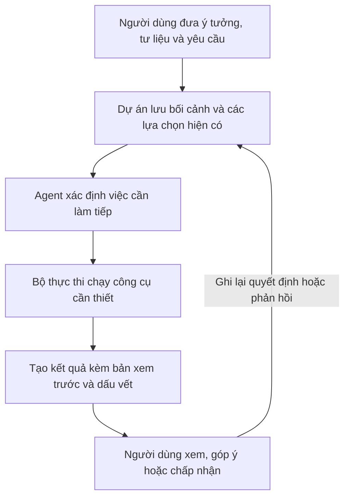
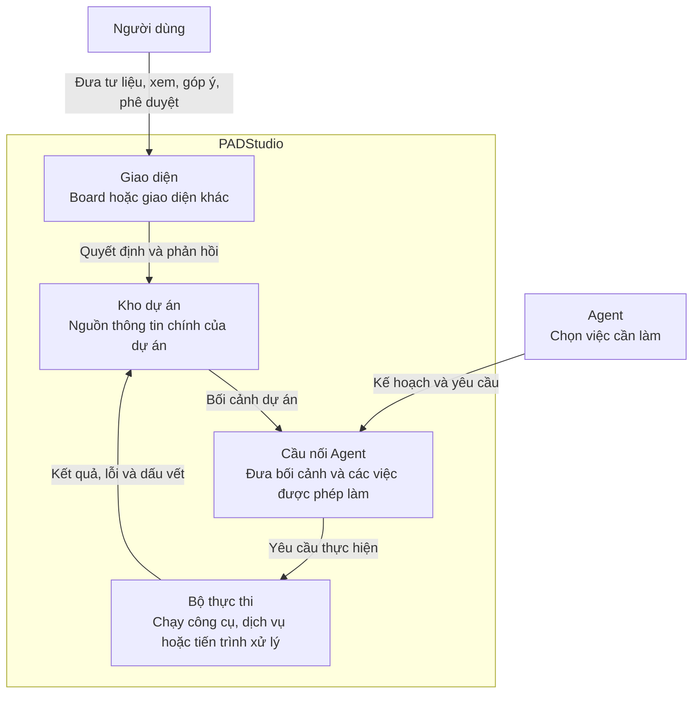
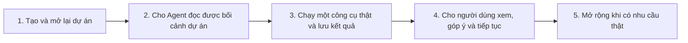

# PADStudio — bản thiết kế ban đầu

PADStudio là hệ thống giúp người dùng và Agent cùng xây dựng một video. Người dùng đưa ý tưởng, tư liệu hoặc yêu cầu; Agent đề xuất và thực hiện công việc; người dùng xem kết quả rồi quyết định giữ hay chỉnh sửa.

Mục tiêu không phải là bấm một nút để tạo toàn bộ video. Mục tiêu là biến quá trình sáng tạo thành một dự án có thể mở lại, hiểu lại và tiếp tục bất cứ lúc nào.

## 1. Một dự án hoạt động như thế nào?

Ví dụ, một dự án có thể bắt đầu bằng brief, script, ảnh hoặc video thô. Agent không bắt buộc phải đi qua cùng một chuỗi bước cho mọi dự án. Khi người dùng đổi ý, hệ thống chỉ cần làm lại phần bị ảnh hưởng và giữ những phần vẫn còn giá trị.

## 2. Hệ thống gồm những phần nào?

| Phần | Nhiệm vụ chính |
| --- | --- |
| **Kho dự án** | Lưu đầu vào, kết quả, lựa chọn, lịch sử, lần chạy và điểm có thể tiếp tục. Đây là nơi hệ thống tra cứu để hiểu dự án đang ở đâu. |
| **Agent** | Hiểu mục tiêu, chọn việc cần làm và quyết định hướng sáng tạo tiếp theo. Agent có thể nằm trong PADStudio hoặc được kết nối từ bên ngoài. |
| **Cầu nối Agent** | Đưa cho Agent bối cảnh của dự án và những việc Agent được phép yêu cầu. Nó không tự quyết định nội dung video. |
| **Bộ thực thi** | Chạy công cụ tạo nội dung, xử lý media hoặc dịch vụ bên ngoài; trả về kết quả hay lỗi một cách rõ ràng. |
| **Giao diện** | Giúp người dùng xem, so sánh, góp ý và phê duyệt. Board chỉ là một giao diện; nó không phải nơi lưu dữ liệu chính của dự án. |

## 3. Ai quyết định điều gì?

- **Người dùng** quyết định mục tiêu, mức độ cho phép hệ thống làm và kết quả nào được chấp nhận.
- **Agent** quyết định việc sáng tạo nào nên làm tiếp và vì sao.
- **PADStudio** cung cấp nơi lưu dự án, cách gọi công cụ và dấu vết để kiểm tra kết quả.

Ba vai trò này cần tách rõ. Vì vậy, giao diện, công cụ tạo video hay nhà cung cấp AI có thể thay đổi mà không làm thay đổi ý nghĩa của dự án.

## 4. Xây hệ thống theo từng phần

Mỗi phần xây xong cần tạo được một vòng hoàn chỉnh: có đầu vào, có kết quả để xem và có cách tiếp tục. Sơ đồ này là thứ tự nên ưu tiên khi xây hệ thống, không phải quy trình bắt buộc mà mọi video phải đi qua.

## 5. Những chi tiết sẽ quyết định sau

Tên bảng dữ liệu, cấu trúc thư mục, API, trạng thái, mô hình AI, công cụ dựng video và nhà cung cấp dịch vụ chưa cần chốt ở đây. Chỉ chọn chúng khi bắt đầu một phần triển khai cụ thể và khi chúng thực sự cần thiết.

Khi cần dàn ý sâu hơn để bắt đầu một phần hệ thống, đọc [`PADSTUDIO-BUILD-OUTLINE.md`](PADSTUDIO-BUILD-OUTLINE.md). Khi chuẩn bị thay đổi code, đọc [`DEVELOPMENT-PROTOCOL.md`](DEVELOPMENT-PROTOCOL.md).
