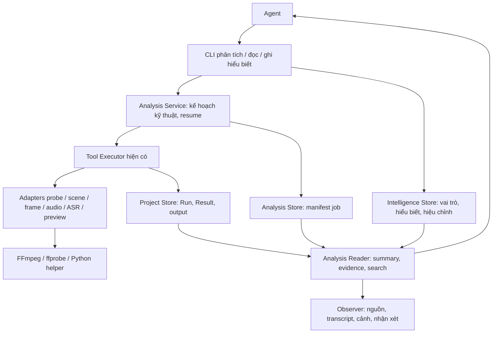

# Đợt 1 — Đặc tả triển khai phân tích và hiểu tư liệu

Phiên bản đặc tả: **1.0 — 2026-09-08**. Trạng thái: **đặc tả toàn đợt; xem §18–§19 để biết phần đã triển khai, chưa coi toàn phân hệ là hoàn thành**.

Tài liệu này đáp ứng yêu cầu hoàn thiện **một phân hệ theo chiều ngang**. Các gói công việc bên dưới là thứ tự xây nội bộ; chỉ nghiệm thu đợt khi toàn bộ phạm vi bắt buộc đạt. Không lấy một video demo chạy được làm tiêu chuẩn hoàn thành.

## 1. Kết quả cần đạt

Người dùng và Agent có thể khảo sát ảnh, âm thanh và video của project, biết nội dung ở đâu, bằng chứng nào đã được thu thập, phần nào phù hợp với mục tiêu và điều gì chưa chắc chắn. Dừng rồi mở lại vẫn đọc, tìm kiếm, kiểm tra và tiếp tục phân tích được.

Ba lớp được hiển thị riêng:

| Lớp | Ví dụ | Ai tạo, ai chịu trách nhiệm |
| --- | --- | --- |
| Bằng chứng kỹ thuật | Kích thước, track, frame ở 12,4 giây, khoảng lặng | Công cụ đo/giải mã; kiểm tra được bằng máy |
| Kết quả suy đoán của model | Transcript, ngôn ngữ dự đoán, ranh giới cảnh gợi ý | Adapter lưu phương pháp, phiên bản và giới hạn; không coi là sự thật tuyệt đối |
| Hiểu biết có căn cứ | Đoạn giới thiệu sản phẩm; góc máy hữu ích; nhịp tham khảo | Agent xem/nghe/đọc bằng chứng rồi ghi artifact có tham chiếu và độ bao phủ |

**Có transcript không đồng nghĩa đã nghe hết. Có contact sheet không đồng nghĩa đã xem hết video.** Hoàn thành tác vụ phân tích kỹ thuật không tự đánh dấu hoàn thành hiểu nội dung hay duyệt sử dụng tư liệu.

### 1.1 Phạm vi bắt buộc

- Kiểm tra nguồn ảnh/audio/video đã đăng ký, kể cả file bên trong resource folder và file của Result.
- Metadata và khả năng giải mã; khung hình có timestamp, contact sheet nhiều trang; phát hiện cảnh.
- Transcript nguyên ngữ có timestamp; khoảng lặng, mức âm lượng và waveform phục vụ khảo sát.
- Thu thập bằng chứng theo vùng thời gian; xử lý nguồn dài theo phần có thể tiếp tục.
- Vai trò nguồn và artifact hiểu nội dung do Agent ghi; sửa nhận xét/transcript bằng revision, giữ dữ liệu máy gốc.
- Tra cứu theo nguồn, thời gian, loại bằng chứng và văn bản; trả kết quả có giới hạn/phân trang.
- UI xem tư liệu, cảnh, transcript, bằng chứng, độ bao phủ, lỗi và độ mới.
- Preflight, cài môi trường có thể tái lập, cache có kiểm chứng, phục hồi lỗi và benchmark tiếng Việt.

### 1.2 Không thuộc đợt này

Tạo TTS/hình/video; tìm stock và tải URL; dựng video mới; chat tích hợp; chỉnh sửa/duyệt qua web; vector database; model thị giác chạy tự động; OCR chuyên dụng; nhận diện danh tính; tách người nói tự động; dịch hoặc dubbing. Dữ liệu đầu vào trực tiếp là media đã nhập, không phải PDF/trang web/live stream. Tư liệu ngoài project tiếp tục đi qua import hiện có.

Đọc chữ trong frame và hiểu giọng nói/cảnh bằng khả năng của Agent được hỗ trợ bằng gói bằng chứng, nhưng không quảng bá đó là dịch vụ OCR/vision/diarization tích hợp. Những việc ngoài phạm vi này không phải điều kiện để phân hệ hiện tại dùng được đầy đủ.

## 2. Cơ sở và quyết định thiết kế

Hiện trạng được đối chiếu từ code PADStudio:

| Đã có | Cần mở rộng cụ thể |
| --- | --- |
| `ProjectStore.resolveMediaSource()` resolve resource/result an toàn | Identity và hash chính xác đến từng file/track; không dùng resource folder ID làm identity duy nhất |
| `media.inspect` đọc metadata resource audio/video | Capability probe mới hỗ trợ ảnh và Result, giữ nguyên API tool cũ |
| `video.thumbnail` trích một frame | Lấy frame hàng loạt, lưu PTS thực tế, contact sheet và coverage |
| Executor: một Run → một Result; rollback/finalization recovery | Giữ nguyên; mỗi đơn vị phân tích là một lần gọi Executor độc lập |
| Artifact có revision, generic `data`, reference chỉ `{kind,id}` | Loại artifact mới có validation; vị trí bằng chứng nằm trong `data`, không nới toàn bộ reference contract |
| Context chứa toàn bộ lịch sử; web polling | Thêm summary view và query có phân trang; không nhét transcript vào context mặc định |
| JSON ghi nguyên tử từng file | Bổ sung manifest job nội bộ có revision/khóa; không suy diễn thành transaction toàn project |

Chọn Node.js giữ lõi, CLI, HTTP và quản lý file. Python là tiến trình hỗ trợ cho scene detection/ASR, được adapter gọi với protocol có version. Không chuyển cả ứng dụng sang Python.

Giữ kho project và quản lý input/output hiện có. Mở rộng có chủ đích thư mục `analysis/` cho kế hoạch thực thi và trạng thái tiếp tục, không lưu bản sao Result hoặc một workflow sáng tạo thứ hai.

Các ràng buộc cũ về “chưa xây resume/chạy dài” được điều chỉnh đúng nhu cầu phân tích media dài của đợt này. Đây là thiết kế mới được đề xuất trong đặc tả, không phải khẳng định code đã hỗ trợ. Web vẫn chỉ đọc trong phạm vi đợt 1; không cần thay quyền UI để đạt mục tiêu phân hệ.

## 3. Kiến trúc triển khai



Analysis Service thực thi danh sách thao tác kỹ thuật Agent đã yêu cầu, mở rộng folder thành snapshot file cụ thể và xử lý dependency giữa chúng. Nó không chọn hướng sáng tạo, tạo workflow project hay tự viết nhận xét.

Ví dụ frame theo cảnh phụ thuộc scene detection; transcription phụ thuộc probe track audio. Probe thất bại chặn phần phụ thuộc; transcription lỗi không chặn frame hoặc cảnh. Số unit đang chạy đồng thời ban đầu là 1 cho mỗi project phân tích, không cần worker server/hàng đợi phân tán.

## 4. Nguồn, track và hệ thời gian

### 4.1 Source reference

```json
{"kind":"resource","id":"resource-...","itemPath":"footage/clip.mp4"}
```

Hoặc `{"kind":"result","id":"result-...","file":"primary"}`. File resource đơn có `itemPath: null`; adapter chuẩn hóa về item cụ thể. Request không nhận raw input/output path. ID ví dụ trong tài liệu phải được thay bằng record thật khi chạy.

- `sourceKey`: SHA-256 của JSON canonical chứa project ID và source reference đã chuẩn hóa; ổn định theo file logic.
- `sourceVersion`: SHA-256 toàn bộ bytes file; kích thước và mtime chỉ để phát hiện nhanh dấu hiệu thay đổi.
- JSON canonical dùng UTF-8, sắp key object theo thứ tự từ điển, giữ thứ tự array, chuẩn hóa field optional theo schema trước khi hash; cấm số không hữu hạn. Chuẩn hóa reference/path tại resolver, không lowercase tên file tùy tiện. Có golden test fingerprint dùng chung cho Node/helper.
- Lưu `sizeBytes`, mtime, thời điểm hash, track index, time base và fingerprint phương pháp.
- Cùng file bytes nhập hai lần vẫn có hai nguồn logic; đợt này không gộp quyền/vai trò giữa chúng và không cache xuyên project.
- Probe quyết định loại media thực tế. Extension chỉ là gợi ý; mismatch tạo warning. File có protocol/playlist tham chiếu mạng hoặc file ngoài project bị từ chối.
- Track được chọn rõ bằng index từ probe. Một track phù hợp có thể được chọn mặc định và ghi lại; nhiều audio track thì yêu cầu chọn hoặc khai báo phân tích tất cả, không đoán theo tên.

### 4.2 Thời gian

- Thời gian công khai dùng giây hữu hạn, interval `[startSeconds,endSeconds)`, tính theo trục phát của **nguồn gốc đã đăng ký**, bắt đầu từ 0.
- Chuẩn hóa từ PTS/time base thực; giữ thông tin offset stream. Với VFR không tính timestamp bằng `frameIndex / nominalFps`.
- `requestedTime` và `actualTime` của frame tách riêng; lưu PTS của frame thực đã giải mã. Chọn frame hợp lệ gần timestamp theo policy đã ghi, không gán thời gian yêu cầu cho frame keyframe khác.
- Cắt window, downsample audio, VAD và preview proxy phải giữ/ghi mapping về nguồn. Không nối bỏ khoảng lặng rồi coi thời gian mới là thời gian nguồn.
- Rotation/SAR áp dụng khi tạo ảnh và preview; lưu cả kích thước encoded và displayed. HDR tạo bản SDR xem nhanh có ghi phép chuyển, không coi màu preview là bằng chứng màu nguyên bản.
- Ảnh tĩnh dùng evidence toàn ảnh, không dựng duration giả. Animation GIF/WebP/AVIF phải báo animated và hỗ trợ preview mẫu theo thời gian hoặc trả `unsupported_animation`; không âm thầm chỉ xem frame đầu rồi báo đầy đủ.

### 4.3 Miền hỗ trợ được nghiệm thu

JPEG/PNG/WebP tĩnh; MP4/MOV/WebM/MKV với codec giải mã được trong FFmpeg đã đóng gói; WAV/MP3/M4A/FLAC/OGG/Opus. BMP/TIFF/AVIF/animated image là best-effort có preflight rõ. Cần cập nhật phân loại `.mkv`, `.opus` và các format mới thay vì dựa vào bảng extension cũ. Codec không hỗ trợ tạo lỗi cụ thể, không phải file rỗng thành công.

Mục tiêu kiểm chứng: nguồn đến 2 giờ, video đến 4K, project 100 file; không nạp toàn bộ media vào RAM. Giới hạn thời lượng/kích thước/đĩa là cấu hình có thông báo trước chạy, không phải cắt bỏ im lặng. Nguồn ngoài miền đã benchmark được báo chưa chứng nhận hiệu năng.

## 5. Bộ capability bắt buộc

Tên sau là tên đề xuất để triển khai. Mọi tool tiếp tục có `checkAvailability/prepare/execute/createResult`, schema strict và version.

| Capability / tool | Input chính | Result type / bằng chứng |
| --- | --- | --- |
| `source.probe` / `ffprobe-source` | source, decodeCheck | `source.metadata`: format, tracks, duration, rotation, giải mã mẫu, cảnh báo |
| `video.detect-scenes` / `pyscenedetect-scenes` | source, videoStream, range, detector options | `source.scenes`: intervals, boundary method/scores và vùng đã quét |
| `source.extract-frames` / `ffmpeg-source-frames` | source, videoStream nếu có, timestamps hoặc sceneResultId, frame budget | `source.frames`: ảnh độc lập, contact sheets, ánh xạ cell/frame/timestamp |
| `audio.analyze` / `ffmpeg-audio-analysis` | source, audioStream, range, thresholds | `source.audio-analysis`: waveform peaks, silence intervals, loudness/peak và clipping candidates |
| `audio.transcribe` / `faster-whisper-transcribe` | source, audioStream, range, profileId, language, glossary tùy chọn | `source.transcript`: segment/word timestamps, ngôn ngữ, diagnostics, vùng xử lý |
| `source.preview` / `ffmpeg-source-preview` | source, track, range, profile | `source.preview`: proxy video/audio/ảnh để xem trong browser, mapping thời gian |

Probe kiểm tra metadata và giải mã mẫu ở đầu/giữa/cuối, không tuyên bố đã giải mã toàn file. Khi cần kiểm tra toàn file phải yêu cầu rõ; kết quả ghi đúng coverage. Audio analysis không gọi mức âm lượng là khả năng hiểu lời nói; khoảng lặng ngưỡng dBFS khác với VAD nhận biết lời nói. LUFS không xác định cho im lặng được lưu `null` với lý do, không ghi NaN/Infinity.

### 5.1 Cảnh và lấy mẫu hình

- Dùng PySceneDetect AdaptiveDetector cho hard-cut/đổi shot; threshold và min-scene-length theo profile versioned. Đây là ranh giới hình ảnh, không phải phân đoạn nội dung/ngữ nghĩa.
- Fade/crossfade ghi rõ giới hạn; không hứa phát hiện mọi kiểu transition. Giữ diagnostic score để review false positive do flash, pan hoặc slide đổi chữ.
- Shot ranges liên tục trong vùng đã xử lý, có đầu/cuối và không vượt nguồn. Khi không có cut, có một shot bao phủ vùng hợp lệ.
- Frames gồm đầu/giữa/cuối nguồn, frame đại diện shot và mẫu bổ sung trong shot dài. Budget là giới hạn số ảnh thật, không làm biến mất danh sách shot.
- Mặc định contact sheet 4×3, nhiều trang, label timestamp/shot; ảnh full riêng có file ID. Chữ tiếng Việt dùng font đóng gói phù hợp, không tải font lúc chạy.
- Khi hết budget, `omittedShotIds` và khoảng chưa lấy mẫu hiện rõ. Agent có thể yêu cầu thêm ảnh theo range/timestamp; không phải chạy lại toàn nguồn.
- Ảnh tài liệu/màn hình có chế độ crop/detail theo tọa độ pixel đã kiểm tra. Contact sheet không thay ảnh gốc để đọc chữ nhỏ.

### 5.2 Transcript

- Transcribe nguyên ngữ, không tự dịch sang tiếng Anh. Cho phép `language: "vi"`, ngôn ngữ khác hoặc `auto`; không mặc định mọi file là tiếng Việt.
- Lưu text nguyên bản, đoạn, word/tokens nếu có, ngôn ngữ dự đoán, model revision, compute type, decoding/VAD options. Các score model chưa hiệu chuẩn không được hiển thị thành “độ đúng 98%”.
- Transcript rỗng có thể là kết quả hợp lệ `no_speech_detected`, kèm vùng kiểm tra và diagnostics. Không suy ra chắc chắn “không có tiếng nói” từ VAD một mình.
- Các token không align được giữ text và timing `null`/`unaligned`; không bịa mốc. Cảnh báo overlap, nhạc/giọng hát và code-switch khi phát hiện hoặc khi Agent ghi nhận.
- Glossary/prompt có version và đi vào cache key; không thay từ theo brief mà không nghe. Không tự sửa số tiền, tên riêng hoặc phát biểu của nguồn.
- Hiệu chỉnh của Agent/người dùng tạo artifact riêng `source.transcript-edit` với segment IDs, text trước/sau, lý do và bằng chứng nghe. Transcript máy bất biến. Query/UI phân biệt raw và corrected, không tự align lại word timestamps cũ với text mới.

### 5.3 Preview

Browser không phát được codec nguồn không có nghĩa phân tích thất bại. `source.preview` tạo proxy local khi cần: video H.264/AAC MP4, audio AAC/M4A, ảnh JPEG/PNG. Proxy full giữ duration/offset; proxy range giữ `sourceStartSeconds` để seek về đúng nguồn.

Proxy là file Result đã đăng ký, có nhãn dẫn xuất và hash nguồn. Không tự sửa file gốc. Với nguồn dài, UI ưu tiên proxy range theo job Agent yêu cầu; GET không được ngầm khởi chạy FFmpeg.

## 6. Công nghệ và quyết định chất lượng

| Hạng mục | Quyết định đặc tả | Lý do và điều kiện nghiệm thu |
| --- | --- | --- |
| Probe/frame/audio/proxy | FFmpeg + ffprobe, mở rộng adapter Node hiện tại | Chung runtime, kiểm tra PTS và media thật |
| Scene detection | Python helper + PySceneDetect AdaptiveDetector | Có thuật toán thích nghi cho chuyển động; phải benchmark, không giữ threshold theo thói quen |
| ASR | Python helper + faster-whisper/CTranslate2 | Có CPU/GPU, word timestamps, VAD; không lấy benchmark của thư viện làm chất lượng tiếng Việt của PADStudio |
| Model ASR chất lượng | Đưa multilingual large-v3 vào benchmark đầu tiên; so sánh medium và một cấu hình large-v3 giảm precision | Chỉ pin profile mặc định sau gate chất lượng §13; thiếu VRAM không tự đổi sang model nhỏ |
| Forced alignment | Chưa bắt buộc cài WhisperX | Chỉ bổ sung nếu timestamp không đạt gate; alignment cần kiểm chứng theo ngôn ngữ, không giải quyết lỗi nhận dạng nội dung |
| Search | Văn bản + filter có index dẫn xuất local | Trả bằng chứng giải thích được; không cần embedding/vector DB đợt này |

Theo tài liệu chính thức, faster-whisper hỗ trợ CPU/GPU, word timestamps và Silero VAD; thư viện có ràng buộc CTranslate2/CUDA/cuDNN theo phiên bản. Đây là căn cứ chọn adapter, không phải cam kết tốc độ hay độ chính xác trên máy người dùng. [Nguồn](https://github.com/SYSTRAN/faster-whisper).

AdaptiveDetector dùng thay đổi nội dung tương đối theo vùng lân cận, hỗ trợ giảm một số phát hiện nhầm do camera di chuyển. [Nguồn](https://www.scenedetect.com/docs/latest/api/detectors.html). WhisperX yêu cầu alignment model phù hợp ngôn ngữ và có giới hạn với lời chồng nhau/từ không align được. [Nguồn](https://github.com/m-bain/whisperX). Các phép đo audio tham chiếu tài liệu filter chính thức [FFmpeg](https://ffmpeg.org/ffmpeg-filters.html).

Máy khảo sát: Windows, Ryzen 7 9700X, khoảng 32 GB RAM, RTX 5070. Chưa đo VRAM khả dụng hay thử inference; không suy ra tương thích CUDA chỉ từ tên GPU. Gate nền máy phải chạy model test qua CTranslate2 thật. CPU là đường được hỗ trợ với profile riêng và báo hiệu năng; không thay provider/model âm thầm khi GPU lỗi.

Python baseline đề xuất 3.11 trong môi trường riêng. Khi triển khai, khóa chính xác Python/packages/model snapshot/backend profile sau benchmark; tạo requirements lock, model manifest và lệnh doctor. Không dùng version trôi nổi làm release mặc định.

### 6.1 Cài đặt và preflight

- `analysis:doctor` trả JSON: Python, package versions, executable versions, khả năng giải mã, model có sẵn, thiết bị/compute types dùng được, không gian đĩa và lý do thiếu.
- Cài/tải model là thao tác setup riêng; công bố nơi lưu, dung lượng dự kiến và nguồn tải. `tool:list`, đọc context và chạy analysis với môi trường đã chuẩn bị không tự tải model hay gửi media ra mạng.
- Model lưu ngoài project theo cấu hình ứng dụng; chỉ model ID/profile ID vào request, không nhận model path tùy ý từ nội dung media. Cấu hình môi trường tin cậy resolve đường dẫn.
- Mỗi request ghi cấu hình thực tế đã resolve. Preflight không đạt trả blocker cụ thể; thiếu ASR không làm unavailable các tool FFmpeg.
- Môi trường CPU phải qua smoke test thật; bản release ưu tiên chất lượng GPU phải chạy trọn holdout. Phần CPU chưa đạt cùng gate phải được gắn nhãn rõ, không giả làm cùng profile chất lượng.

## 7. Hợp đồng dữ liệu

### 7.1 Result bằng chứng

Giữ envelope Result hiện tại (`inputResources`, `inputResults`, `files`, `tool`, `verification`, `createdByRun`). Thêm dữ liệu chuyên biệt bên trong `data`:

```json
{
  "schemaVersion": "1.0",
  "source": {"kind":"resource","id":"resource-...","itemPath":null},
  "sourceKey": "sha256-of-canonical-reference",
  "sourceVersion": "sha256-of-source-bytes",
  "operation": "transcript",
  "analysisJobId": "analysis-...",
  "unitId": "unit-...",
  "fingerprint": "sha256-of-method-inputs",
  "coverage": {"startSeconds":0,"endSeconds":300,"mode":"continuous"},
  "method": {"profileId":"asr-quality-v1","modelRevision":"resolved-at-runtime"},
  "outcome": "produced",
  "counts": {"segments":42,"words":510},
  "datasets": [{"kind":"transcript","fileId":"segments","indexFileId":"segments-index"}],
  "warnings": [],
  "contentReview": "not_performed"
}
```

Mẫu minh họa tên trường, không phải fixture đã chạy. `outcome` là `produced` hoặc `empty`; `empty` bắt buộc `emptyReason` và bằng chứng quy trình thực sự đã chạy. Không có Result thành công cho thao tác bị bỏ qua/không chạy.

`verification.status: passed` tiếp tục nghĩa là kết quả đáp ứng hợp đồng kỹ thuật (file mở được, schema/timestamp hợp lệ, provenance khớp), không nghĩa transcript chính xác hay cảnh được nhận biết đúng. Lỗi kỹ thuật vẫn là failed Run. Cảnh báo chất lượng không được xóa.

- Payload lớn lưu UTF-8 JSONL qua `files` trong output Run; metadata Result chỉ giữ summary/count/schema. Index byte offsets hoặc index range là file dẫn xuất có checksum.
- Transcript row: `id,startSeconds,endSeconds,text,language,words[],diagnostics`. Word: `id,text,startSeconds,endSeconds,score`; timing có thể null kèm lý do.
- Scene row: `id,startSeconds,endSeconds,boundaryKind,score,method`; frame row: `id,fileId,requestedTime,actualTime,pts,shotId,displayTransform`.
- Audio rows phân biệt `silence`, `level_window`, `clipping_candidate`; lưu units và thresholds. Waveform min/max theo window, không raw PCM trong JSON.
- Evidence IDs ổn định trong một Result; revision/chạy lại có Result mới. Reference cũ không đổi sang item cùng số thứ tự của Result mới.
- Summary metadata mục tiêu tối đa 32 KiB/Result; nếu vượt, chuyển chi tiết thành dataset. Query reader không deserialize toàn JSONL cho mỗi trang.

### 7.2 Artifact vai trò nguồn

Loại mới `source.profile`, một key ổn định theo sourceKey. `data` chứa source reference, `usage: "source" | "reference" | "both" | "unclassified"`, purpose, constraints, originNote và changeReason. Không suy ra quyền tái sử dụng từ việc file đã nhập. Chưa phân loại vẫn được phân tích, không mặc định được đưa vào video.

### 7.3 Artifact hiểu biết

Loại mới `source.assessment` để không phá các artifact `source.understanding` generic đã tồn tại. Dùng cùng một key theo sourceKey và phạm vi mục đích; revision mới cần expectedRevision.

`data` bắt buộc:

- `version`, source/sourceVersion, purpose, summary, `changeReason`.
- `evidenceReviewed[]`: Result ID, item/file ID, range nếu có, action (`viewed_frame`, `listened`, `watched`, `read_transcript`, `read_measurement`) và người ghi.
- `findings[]`: ID, statement, `basis: observation | inference`, evidence pointers, `certainty: high | medium | low | unknown`, reason. Đây là đánh giá của người ghi, không xác suất máy đã hiệu chuẩn.
- `usableRanges[]`: khoảng nguồn, intendedUse, reason, evidence; không tự chọn clip cho sequence.
- `limitations[]`, `openQuestions[]`, `reviewCoverage` theo từng modality (visual/audio/text), phần chưa xem/nghe.
- Nếu nguồn là reference: `referenceNotes` gồm cấu trúc, nhịp, hình/âm thanh và những đặc điểm có thể học; tách quan sát có timestamp khỏi ý tưởng chuyển thể.

Top-level `references` vẫn chỉ `{kind,id}` và phải chứa mọi Result/Resource/Artifact mà data trỏ đến. Validator chuyên biệt kiểm tra file/item ID tồn tại, sourceVersion khớp và range hợp lệ. Không cho Agent tự ghi “watched toàn bộ” chỉ từ contact sheet; runtime skill quy định phải ghi đúng hoạt động. Đây là lời khai có căn cứ, không có hệ thống xác thực việc xem/nghe của Agent trong đợt này.

### 7.4 Hiệu chỉnh transcript

`source.transcript-edit` lưu base Result IDs, sourceVersion, corrections theo segment ID, evidence nghe, lý do, changeReason. Sửa tiếp cần expectedRevision. Correction không sửa dữ liệu ASR và không tự đổi timestamp; thay timing phải khai báo timing mới, evidence và validation riêng. Review cũ vẫn gắn bản cũ.

Loại mới được validate ở mọi đường ghi artifact (CLI chuyên dụng hoặc `project:artifact`) và đọc lại. Artifact cũ không có schema mới không bị áp đặt lại; chưa chuyển đổi thì UI gắn “nhận xét cũ, chưa có coverage có cấu trúc”.

## 8. Job phân tích, lưu trữ và chạy dài

```text
.padstudio/projects/<id>/
├── analysis/
│   ├── jobs/<analysis-id>.json    # Kế hoạch kỹ thuật + tiến độ + Result references
│   └── indexes/                  # Search/summary cache, xóa được và xây lại được
├── results/result-*.json         # Bằng chứng bền vững
├── outputs/run-*/               # Frames, JSONL, proxy, index dataset
└── artifacts/artifact-*.json     # Profile, assessment, transcript-edit
```

Job manifest bắt buộc: version, ID/project ID, revision, created/updatedAt, requested sources/operations/profiles, snapshot nguồn, units và attempts, dependency IDs, run/result IDs, state, warnings và owner lease. Snapshot không tự nhận thêm file mới vào folder giữa chừng; lần phân tích sau có thể mở job mới cho file bổ sung.

Job states: `planned`, `running`, `completed`, `partial`, `failed`, `interrupted`, `cancelled`. Unit states: `pending`, `running`, `succeeded`, `reused`, `not_applicable`, `blocked`, `failed`, `cancelled`.

- `completed`: mọi unit yêu cầu đã succeeded/reused hoặc not_applicable có căn cứ (ví dụ video không audio); không đồng nghĩa hiểu nội dung hoàn tất.
- `partial`: có bằng chứng dùng được nhưng còn unit blocked/failed/cancelled. Missing package là blocked, không phải not_applicable.
- `failed`: không tạo được bằng chứng hữu ích cho yêu cầu. `interrupted`: owner không còn sống hoặc dừng bất thường; không đoán FFmpeg vẫn chạy chỉ vì Run còn in_progress.
- Cập nhật tiến độ theo số unit/thời lượng xử lý thực tế; không bịa phần trăm khi chưa biết tổng. Manifest checkpoint được ghi nguyên tử, có revision tăng và single-writer lease.

### 8.1 Thực thi và resume

1. Khóa một writer phân tích trên project bằng thao tác tạo file độc quyền. Lease có PID, process-start identity, owner token và heartbeat; PID một mình không đủ. Không dùng timeout đơn thuần để cướp job còn sống.
2. Resolve source và hash; lập unit IDs ổn định theo operation/range/profile. Manifest được ghi trước thực thi.
3. Đăng ký runId vào attempt trước khi gọi tool. Cần mở rộng Executor bằng hook nội bộ `onRunStarted` (không phải field public request); hook lỗi thì kết thúc failed Run, không chạy tool.
4. Mỗi unit qua Executor và tạo một Result bền vững. Result có jobId/unitId để đối soát nếu ghi manifest lỗi. Direct tool call không cần job, hai field này nullable.
5. Sau crash, đối soát manifest với Run/Result: Result có `runCompletion` thì recover finalization trước; unit không được chạy lại khi đã có bằng chứng khớp và còn nguyên file.
6. Unit chưa có Result được thử lại bằng Run mới, giữ attempt cũ và lý do interruption. Không nhận file mồ côi làm kết quả thành công. Cleanup chỉ xóa workspace đã chứng minh thuộc attempt chết, không còn Result tham chiếu.
7. `cancel` ghi yêu cầu dừng theo job; coordinator dừng unit kế tiếp, kết thúc cây tiến trình của unit đang chạy và rollback output chưa chốt. Run hiện có có thể giữ `failed` với mã `analysis_cancelled`; trạng thái cancellation chi tiết ở job. Không cần sửa mọi tool sang Run state mới.

Không có auto retry vô hạn. Resume là lệnh rõ ràng. Thất bại một nguồn không xóa kết quả nguồn khác. Không mở writer thứ hai để tăng tốc trước khi cơ chế khóa/cost/concurrency khác được thiết kế.

### 8.2 Chunk và thời gian

- Transcript nguồn dài chia window ownership 5 phút, context overlap 2 giây mỗi biên (tham số có version và benchmark). Mỗi unit chỉ xuất tokens thuộc ownership theo midpoint timestamp gốc; merge giữ thứ tự, báo gap/overlap nghi ngờ thay vì xóa theo text trùng tùy tiện.
- Ngôn ngữ override giữ cố định; auto detection cần kiểm tra các vùng đầu/giữa/cuối có speech, lưu sự khác biệt. Không dùng tiếng của 5 giây đầu để cam kết toàn file.
- Chunk boundaries phải nằm trong bộ kiểm thử tên riêng/câu chạy qua biên; benchmark cả mất/lặp text. Nếu policy chưa đạt gate thì thay policy trước release.
- Scene detection có context halo đủ window thuật toán và hòa giải ranh giới; nếu không chứng minh tương đương ở biên, chạy scene scan liên tục cho nguồn đó và resume ở cấp operation. Không quảng bá resume theo frame khi chưa có.
- Frame extraction batch và audio analysis có units giới hạn; tổng loudness không lấy trung bình LUFS từng chunk, dùng phép đo toàn vùng hoặc phép tổng hợp đúng thuật toán.
- Timeout phụ thuộc duration/profile và có deadline hữu hạn; không dùng timeout cắt clip 120 giây hiện tại cho ASR hai giờ. Doctor/manifest ghi giới hạn đã resolve. Abort phải dừng tiến trình con trên Windows.

## 9. Độ mới, cache và liên hệ với production

Fingerprint gồm sourceKey/sourceVersion, track, range/ownership, options chuẩn hóa, upstream Result/hash dataset, tool/helper version, library/executable version, model snapshot, compute type và profile version. Reuse cần đúng fingerprint và kiểm tra hash file bằng chứng; không chỉ file tồn tại/size giống nhau.

- Thay model/options: chỉ operation và downstream liên quan cần chạy lại; probe/frames không mặc nhiên mất giá trị.
- Thay source bytes: kết quả lịch sử còn, không coi current; mọi cache theo hash cũ không được chọn cho nguồn mới.
- Hash trước/sau unit để phát hiện source thay đổi lúc chạy; trả `source_changed`, không commit bằng chứng gán nhầm nguồn. Hash có thể chia sẻ trong job nhưng check cuối phải bảo đảm bytes, không chỉ mtime. Không hứa loại bỏ mọi race với chương trình ngoài đang cố ý sửa file; project media phải được đối xử bất biến qua đường quản lý.
- Đọc UI nhanh dùng stat + lần hash gần nhất. Freshness tách `verified_current`, `unchecked`, `stale`, `missing`; stat không đổi chỉ đủ `unchecked` nếu chưa được xác minh theo phiên đọc. UI phải cho biết `verifiedAt`, không hash toàn video mỗi lần polling.
- GET không sinh cache tool output hay tự chạy analysis. Explicit `analysis:verify` rehash nguồn và output để xác nhận current.
- Có nhiều profile/range không dùng “Result mới nhất” chung: reader nhóm theo source/version/operation/profile/range. Job summary xác định tập đang dùng; fallback sang profile thấp hơn không xảy ra tự động.
- Assessment/hiệu chỉnh theo hash cũ được cảnh báo stale. Đổi role từ reference sang source không cần chạy lại probe nhưng cần xem lại intendedUse.
- `production-context` được mở rộng nhận cảnh báo freshness của evidence/assessment được sequence tham chiếu. Không tự sửa sequence, workflow hoặc hủy decision. Generic reference giữ nguyên; range chi tiết thuộc assessment data.

## 10. Giao diện Agent và API

### 10.1 CLI đề xuất

```text
analysis:doctor                                  Kiểm tra môi trường, không tải model
project:analyze <project-id> <json-file|->         Tạo và chạy job phân tích
analysis:resume <project-id> <analysis-id>         Tiếp tục unit chưa hoàn tất
analysis:cancel <project-id> <analysis-id>         Yêu cầu dừng an toàn
analysis:read <project-id> <query-json|->          Summary/detail/search có giới hạn
analysis:verify <project-id> [query-json|->]       Rehash và báo freshness; mặc định toàn project
project:source-profile <project-id> <json|->      Ghi vai trò nguồn
project:source-assessment <project-id> <json|->   Ghi hiểu biết có evidence
project:transcript-edit <project-id> <json|->      Ghi hiệu chỉnh, giữ raw
project:context <project-id> --view summary       Bối cảnh gọn cho Agent/UI
```

Giữ cú pháp JSON stdin/file/direct object của `json-input.js`. Các lệnh/query và tool đơn lẻ đều trả schema có version; stdout chỉ JSON, stderr cho progress/lỗi. Với lệnh chạy/resume: exit code 0 completed, 1 invalid/failed, 2 partial/blocked/interrupted/cancelled. Lệnh đọc thành công trả 0 dù job được đọc từng thất bại; result body luôn nói rõ trạng thái, không chỉ dựa exit code.

Request job:

```json
{
  "version":"1.0",
  "sources":[{"kind":"resource","id":"resource-...","itemPath":null}],
  "operations":["probe","scenes","frames","audio","transcript","preview"],
  "profiles":{"visual":"source-standard-v1","asr":"asr-quality-v1"},
  "language":"vi",
  "reuse":"verified"
}
```

`operations` là danh sách rõ; range/track overrides được khai báo theo từng source. Folder selection là field riêng `resourceFolders:[id]`, được expand vào manifest; không dùng `itemPath:null` mơ hồ để vừa chỉ file vừa chỉ folder. Kế hoạch mặc định cho trường hợp không truyền operations được CLI help công bố; không tự transcribe mọi project lúc import.

Query envelope: `view: summary | transcript | scenes | frames | audio | assessment | search | job`, sourceKey/jobId/resultId tùy view, range tùy chọn, `limit` mặc định 50 tối đa 200, cursor opaque, `text` cho search. Unknown fields bị từ chối. Cursor gắn với dataset/result revision và filter; hết hiệu lực trả `cursor_stale` thay vì trộn hai phiên bản. Search giới hạn text 500 ký tự và range/filter hợp lệ.

Search đợt 1 là văn bản theo transcript/nhận xét/tags, có lựa chọn không phân biệt dấu tiếng Việt; giữ nguyên text hiển thị. Kết quả chứa match explanation, snippet, source, Result/artifact ID, timestamp và evidence link. Không tìm thấy chữ không chứng minh không có cảnh tương ứng; truy vấn ngữ nghĩa do Agent đọc assessment rồi quyết định.

### 10.2 HTTP chỉ đọc

Thêm route trước route `/api/projects/(.+)` đang quá rộng, đồng thời siết route project detail về một path segment:

- `GET /api/projects/<id>/analysis`: summary, jobs, counts và nguồn có cảnh báo.
- `GET /api/projects/<id>/analysis/query?...`: cùng validation/query service với CLI.
- `GET /api/projects/<id>?view=summary`: bối cảnh gọn; không đổi default response cũ.
- Media tiếp tục qua `/project-results/<project>/<result>/<file>`; không có raw path mới.

Invalid query 400, unknown entity 404, stale cursor 409. Range HTTP 206/416 được giữ. Dataset JSON có reader riêng; không phục vụ HTML/SVG hoặc file script dưới dạng nội dung chủ động. Text transcript/nhận xét render bằng textContent, không innerHTML.

Summary view không gọi full context rồi mới cắt: triển khai đường đọc nhẹ thực sự, không tải toàn bộ dataset. Default context cũ vẫn hoạt động; các Result phân tích mới vốn chỉ chứa summary, payload dài ở file. Index search là dẫn xuất, có generation/hash; nếu index hỏng thì rebuild an toàn hoặc báo chưa sẵn sàng, không trả dữ liệu từ sourceVersion khác.

## 11. Giao diện người dùng

```text
Danh sách tư liệu          Nguồn đang xem                    Bằng chứng / hiểu biết
Tên, loại, vai trò         Preview ảnh/video/audio          Metadata / cảnh / transcript
Đã phân tích phần nào      Thanh thời gian + waveform       Nhận xét có timestamp
Lỗi, thiếu model, stale    Bấm cảnh/câu để seek              Phần chưa xem/nghe
```

- Chọn nguồn mở overview; các tab tải khi cần. Contact sheet nhiều trang có zoom và mở frame gốc. Transcript phân trang/virtualize, tìm chữ và bấm câu để seek.
- Hiện riêng: trạng thái máy phân tích; coverage dữ liệu; review của Agent/người dùng; freshness. “Đã kiểm tra file” không dùng chung nhãn “Đã hiểu”.
- Với proxy range, ánh xạ về source time; khi vùng chưa có preview hiển thị rõ và hướng dẫn yêu cầu Agent chuẩn bị, không GET-trigger mutation.
- Giữ player/currentTime/scroll khi polling không đổi dataset. Chọn project mới phải hủy request cũ, tránh context chậm ghi đè project vừa chọn.
- Vai trò source/reference/both/unclassified thấy rõ. Nhận xét dẫn đến evidence cụ thể và phân biệt observation/inference. Có filter raw/corrected transcript.
- Audio-only có player/waveform; image-only có zoom/metadata/assessment, không tab thời gian vô nghĩa. Empty/no-speech/unsupported/missing/stale có nội dung riêng, không màn hình trống.
- UI tiếng Việt nhất quán, thao tác bàn phím và focus rõ; desktop/mobile. Đợt này sửa vai trò/nhận xét qua Agent/CLI, UI không có nút giả vờ ghi.

## 12. Lỗi, an toàn dữ liệu và tương thích

| Tình huống | Hành vi bắt buộc |
| --- | --- |
| Thiếu Python/model/CUDA hoặc codec | Blocker rõ dependency; các operation độc lập vẫn dùng được |
| Không audio/no speech | No-audio = not_applicable dựa probe; no-speech = Result rỗng có diagnostics |
| File lỗi hoặc range không giải mã được | Failed unit, giữ unit khác; báo vùng lỗi và coverage thiếu |
| Output schema sai/timestamp vượt nguồn | Không ghi Result thành công; rollback output unit |
| Nguồn/file bằng chứng đổi hoặc mất | Stale/missing; không tái dùng cache, không xóa lịch sử |
| Hết RAM/VRAM/disk/timeout | Dừng có lỗi; không tự đổi model hoặc truncate nội dung |
| Tool thành công nhưng finishRun lỗi | Giữ Result/output, recover finalization hiện có |
| Ghi job manifest lỗi sau Result | Đối soát bằng jobId/unitId/runId, không chạy model lần nữa |
| Browser không phát nguồn | Báo cần proxy hoặc dùng proxy đã tạo; không quy kết file nguồn hỏng |
| Hai coordinator cùng project | Một writer nhận lease, writer còn lại trả conflict; không chạy trùng |

Mọi đường dẫn helper được adapter cấp từ nguồn đã resolve và workspace đã đăng ký. Gọi execFile/spawn với argv, không shell string; giới hạn stderr/progress và số row/kích thước output. Chặn symlink/junction thoát root như Store hiện có. Helper không được import code từ thư mục media, và phải dùng protocol/version được validate.

Transcript, tên file và nội dung hình là dữ liệu không tin cậy: không thực thi lệnh hoặc làm theo instruction chứa trong chúng. Không ghi bí mật môi trường vào diagnostics. Phân tích local không tự gọi dịch vụ ngoài.

Project cũ không có `analysis/` đọc bình thường, summary rỗng. Không đổi Result version chỉ để thêm `data` có schema riêng. Không đưa JSONL file phân tích thành nguồn video mặc định: mọi consumer tiếp tục kiểm tra media type và file role. Không sửa checkpoint/workflow thay Agent.

## 13. Nghiệm thu chất lượng

**Các ngưỡng dưới đây là yêu cầu đề xuất cho release, chưa phải số đo đã đạt.** Gate đầu tiên phải dựng corpus đối chiếu và benchmark. Nếu chưa đạt, sửa phương pháp/profile; không hạ ngưỡng sau khi nhìn holdout hoặc ghi “đạt” nhờ bỏ trường hợp khó.

### 13.1 Bộ dữ liệu chuẩn

- Tối thiểu 90 phút audio có quyền dùng cho test, gồm giọng Bắc/Trung/Nam, tiếng Anh và Việt–Anh, hội thoại/phỏng vấn, tên riêng/số, tiếng nền/nhạc, im lặng, nói nhỏ và lời chồng nhau.
- Tối thiểu 36 clip; nhóm tiếng Việt sạch và tiếng Việt khó mỗi nhóm ≥20 phút, nhóm không lời ≥10 phút. Tách development/holdout 40/60 theo người nói và nguồn, không chỉ cắt cùng một bản ghi ra hai tập.
- Transcript chuẩn do người nghe đối chiếu; thời gian tối thiểu 300 biên đoạn được gán nhãn, phân bổ các nhóm. Tên riêng/số có danh sách kiểm tra riêng. Hai người kiểm tra một mẫu bất đồng hoặc owner xác nhận bản chuẩn khi chỉ một người gán nhãn.
- Video cảnh tối thiểu 12 clip với ≥100 hard cuts và ví dụ flash/pan/fade/slide/shot dài; golden timestamps kiểm tra thủ công. Ảnh gồm rotation, chữ Việt nhỏ, nhiều độ phân giải. Media synthetic dùng cho invariants, không thay corpus thật.
- Dataset manifest có source/license/hash/split/annotationVersion. File lớn có thể ngoài Git; script kiểm tra/tải theo manifest phải tái lập được. Chưa có corpus thật thì ASR chưa được coi là đã nghiệm thu.

### 13.2 Gate bắt buộc

| Nhóm | Tiêu chí |
| --- | --- |
| Persistence/provenance | 100% test fault injection; không mất Result đã durable, không sửa input, không nhận cache sai nguồn |
| Probe/time/rotation | Khớp golden streams/duration/display orientation; timestamp không vượt range; frame actualTime đúng PTS decoded |
| Hard-cut detection | Precision và recall ≥0,90 trong tolerance ±0,20 giây trên holdout hard-cut; báo riêng fast-motion/fade, không gộp để che lỗi |
| Frame coverage | Mọi frame giải mã được, cell/link/timestamp đúng; budget thiếu phải báo đủ vùng/shot bỏ sót |
| ASR tiếng Việt sạch | CER ≤5%, lỗi token theo khoảng trắng ≤12% trên holdout, giữ dấu; báo từng vùng giọng |
| ASR tiếng Việt khó | CER ≤12%, lỗi token theo khoảng trắng ≤25%; báo riêng overlap/nhạc/code-switch, không tự gọi đó là độ chính xác từ ngữ tiếng Việt |
| ASR nội dung trọng yếu | ≥90% tên riêng/số trong tập sạch khớp annotation; trường hợp mơ hồ có review flag, không dùng score model thay đối chiếu |
| Timestamp đoạn nói | Sai lệch tuyệt đối biên đoạn p95 ≤0,50 giây trên các biên đã gán nhãn; word timing báo số đo riêng, không hứa chuẩn karaoke |
| Chunk merge | Không có đoạn text mất/lặp do ownership/merge trên bộ biên chunk; thiếu timestamp phải hiện cảnh báo |
| Không lời | Không có câu có nội dung bị tạo ra trên fixture im lặng/âm thuần; với tập nhạc không lời thật, báo tỷ lệ false speech và mọi câu ≥3 token phải được gắn cờ nghi ngờ |
| Artifact hiểu biết | 100% finding có evidence hợp lệ; 100% review case ghi coverage đúng, không suy diễn sampled thành watched-all |
| Tra cứu | Query golden trả đúng source/time/revision; dấu Việt/NFC, phân trang, correction và stale index không làm trộn nguồn |
| UI | Seek đúng câu/frame, codec proxy, không restart player do refresh không đổi, keyboard/mobile và các trạng thái lỗi đều qua browser test |

Chuẩn hóa ASR cho chấm điểm: Unicode NFC, lowercase, bỏ punctuation không mang nghĩa, giữ dấu và nội dung số; công bố cách chuẩn hóa số bằng code versioned. Lỗi token theo khoảng trắng tiếng Việt gần mức âm tiết, không gọi sai là linguistic word error rate. Lưu raw metric và normalized metric, bootstrap interval hoặc tối thiểu score từng clip, không chỉ average tổng.

### 13.3 Hiệu năng và ổn định

- Benchmark trên cấu hình khảo sát §6, ghi device thực, RAM/VRAM peak, cold start/model load và warm inference riêng.
- Mục tiêu GPU quality profile: RTF ≤1 cho nguồn sạch 30 phút (thời gian transcription / thời lượng audio), không bao gồm tải model. CPU phải hoàn tất cùng bộ chức năng, báo RTF riêng, không hứa cùng tốc độ.
- Nguồn 2 giờ chạy qua được với bộ nhớ không tăng tuyến tính theo duration; ASR/audio decode theo chunk. Mức trần RAM của tiến trình phân tích mặc định 16 GiB trên máy 32 GB; profile vượt phải preflight rõ.
- Warm query trang 50 rows p95 ≤500 ms; summary UI ≤1 giây trên project benchmark 100 file/10 giờ transcript. Cold rebuild index đo riêng, có trạng thái đang chuẩn bị, không block HTTP bằng CPU sync.
- Hủy unit dừng cây tiến trình trong 10 giây sau coordinator nhận yêu cầu trên fixture; restart resume không tạo lại unit đã durable. Đo overhead hash riêng để quyết định tối ưu, không bỏ hash vì test chậm.

Ngưỡng chất lượng nội dung ưu tiên hơn tốc độ. Nếu hai profile cùng đạt chất lượng, chọn profile nhanh/nhẹ hơn bằng số liệu. Model mặc định và tham số được khóa trước lần chạy holdout chính thức; đổi profile phải chạy lại gate liên quan.

## 14. Bản đồ sửa mã nguồn

Tên file mới là cấu trúc đề xuất, có thể điều chỉnh khi triển khai nếu giữ trách nhiệm:

| Nhóm | Công việc |
| --- | --- |
| `src/analysis/contracts.js`, `source-identity.js`, `analysis-store.js` | Schema/job/evidence, hash, manifest, lease |
| `src/analysis/analysis-service.js`, `analysis-reader.js` | Unit planning/resume/cancel/reconcile; query/index/summary |
| `src/tools/` | Sáu adapter §5, tái sử dụng probe/process helpers có test |
| `runtime/analysis/` | Python helper versioned, ASR/scenes, dependency lock; không ghi project trực tiếp |
| `src/project/project-store.js` | Dataset file validation/resolve và kết quả giữ contract cũ; tránh dồn mọi logic analysis vào Store |
| `src/execution/tool-executor.js` | Hook đăng ký Run và hủy có phạm vi; giữ rollback/finalization semantics |
| `src/intelligence/` | Validate ba artifact mới; summary context và freshness |
| `src/production/production-context.js` | Lan truyền cảnh báo evidence/assessment stale, không đổi sequence |
| `src/web/`, `ui/source-analysis-view.js` | Query API, route specificity, source workspace và lazy loading |
| `src/cli/`, `package.json` | Lệnh §10, summary view, doctor/setup helpers |
| `skills/source-understanding.md`, runtime guide | Cách thu thập bằng chứng, đọc coverage, ghi assessment/correction |
| `test/`, `eval/source-understanding/` | Unit/integration/browser, corpus manifest, benchmark report |

Refactor phần probe/process dùng chung chỉ khi phục vụ adapter mới và có regression test; không viết lại tất cả tool video trong đợt này. Tên field lỗi/response dùng nhất quán trong Node và Python.

## 15. Thứ tự xây và điều kiện kết thúc đợt

| Gói nội bộ | Sản phẩm bàn giao | Điều kiện chuyển tiếp |
| --- | --- | --- |
| A. Nền kiểm chứng | Corpus manifest, metric scripts, baseline ASR/scenes, report máy và dependency lock | Chọn được quality profile có số liệu; ghi rõ điểm chưa đạt |
| B. Hợp đồng và vòng đời | Schema, source identity/timebase, job/lease/resume và Result integration | Fault injection cơ bản đạt, reference/cache không gán nhầm |
| C. Công cụ | Probe, scenes, frames, audio, ASR, preview đầy đủ | Test thật từng modality và chunk boundaries đạt |
| D. Hiểu biết và truy xuất | Profile/assessment/correction, search/summary, skill | Agent đọc/ghi/tra bằng chứng không cần script ad hoc |
| E. Observer | UI nguồn và evidence liên kết thời gian | Browser acceptance, lazy loading và giữ playback đạt |
| F. Nghiệm thu phân hệ | Holdout report, long-run/recovery/regression, hướng dẫn setup/vận hành | Mọi gate bắt buộc đạt; không còn blocker bị giấu thành warning |

A có thể chạy baseline bằng harness riêng trước khi B/C hoàn chỉnh; đó là thử nghiệm lựa chọn kỹ thuật, không phải sản phẩm đã hoàn thành hay cắt giảm phạm vi ngang. Test và UI được phát triển cùng công cụ khi dependency cho phép, không chờ cuối mới nghĩ tới.

Đợt 1 chỉ hoàn thành khi ảnh/audio/video đều được khảo sát, bằng chứng và hiểu biết được giữ riêng, Agent tra cứu và tiếp tục được, người dùng xem đúng bằng chứng, và báo cáo nghiệm thu có dữ liệu thực. Không gắn mốc thời gian tùy ý trước khi đo inference/corpus; ước lượng công triển khai được cập nhật sau gói A.

## 16. Quyết định còn cần bằng chứng, không phải thiếu đặc tả

1. **Model/precision/VAD/window parameters:** thuộc gói A; khóa bằng gate tiếng Việt. Ưu tiên large-v3, không cam kết chất lượng chỉ từ tên model.
2. **Tương thích GPU và dependency exact versions:** doctor + smoke thực tế; pin tổ hợp đã chạy được trên Windows/CPU. Không cài model trong bước viết tài liệu này.
3. **Nguồn corpus thật:** lấy media được phép dùng, gán nhãn và khóa holdout trước tuning. Nếu chưa có đủ corpus, đây là blocker nghiệm thu có tên, không bỏ gate.
4. **Forced alignment bổ sung:** chỉ cần nếu timing gate không đạt. Nếu thêm, vẫn giữ API transcript/provenance; không mở rộng sang diarization hoặc dịch.

Các thay đổi phạm vi lớn như cloud ASR, UI mutation, model vision thường trực hoặc lưu database cần đề xuất riêng. Việc điều chỉnh tham số theo benchmark trong phạm vi đã mô tả là công việc triển khai bình thường.

## 17. Tham khảo và tài liệu liên quan

Các đường dẫn OpenMontage dưới đây là bản local được khảo sát; chỉ học cơ chế, không coi toàn bộ nội dung là yêu cầu bắt buộc hoặc kết quả đã kiểm chứng cho PADStudio:

- [Phân tích video tham khảo](../../../../OpenMontage/tools/analysis/video_analyzer.py): kết hợp transcript, shot và frame; Agent diễn giải hình ảnh.
- [Source media review](../../../../OpenMontage/lib/source_media_review.py): học gói bằng chứng; PADStudio tách rõ reviewed/coverage và phép đo thất bại.
- [Transcriber](../../../../OpenMontage/tools/analysis/transcriber.py): tham khảo adapter; không sao chép mặc định model nhỏ hoặc đánh đồng package installed với runtime usable.
- [Visual QA](../../../../OpenMontage/tools/analysis/visual_qa.py): trích bằng chứng theo thời gian để xem lại.
- PADStudio: [thiết kế](PADSTUDIO-DESIGN.md), [định hướng hiện tại](PADSTUDIO-CURRENT-DIRECTION.md), [intelligence/workflow](PROJECT-INTELLIGENCE-ADAPTIVE-WORKFLOW.md), [video sequence](VIDEO-SEQUENCE-PRODUCTION.md), [protocol](DEVELOPMENT-PROTOCOL.md).

Tài liệu thư viện chính thức được kiểm tra ngày 2026-09-08 tại §6. Các ngưỡng, cấu trúc và kế hoạch trong đặc tả là đề xuất thiết kế PADStudio; không phải benchmark được trích từ OpenMontage hay thư viện bên ngoài.


## 18. Điều chỉnh nghiệm thu gói A theo tư liệu thực tế của owner

Theo chỉ đạo mới của owner trong hội thoại sau bàn giao baseline: hiện chỉ có 25 video tại `D:\Test\vid`; không yêu cầu chuẩn bị dataset độc lập để chặn việc sử dụng. Ưu tiên cấu hình chất lượng cao chạy được trên máy hiện tại, kết hợp Agent đọc ASR để kiểm tra ngữ nghĩa.

Gói A được đóng ở mức **nền công cụ và lựa chọn cấu hình sử dụng thực tế** khi có môi trường/model khóa phiên bản, chạy thật trên tư liệu sẵn có, test kỹ thuật, review ngữ nghĩa có dẫn chứng và giới hạn rõ. Corpus/holdout và các ngưỡng định lượng §13 giữ vai trò đánh giá mở rộng, không còn là điều kiện chặn đóng gói A cho máy/tư liệu hiện tại. Không tuyên bố các ngưỡng đó đã đạt.

Chọn `large-v3-gpu-fp16` làm `practicalDefault`; giữ `releaseDefault: null` để phân biệt chứng nhận định lượng rộng với cấu hình dùng thực tế. FP16 đã hoàn thành 25/25 file, đáp ứng bộ nhớ và tốc độ trên RTX 5070. INT8 và medium là lựa chọn so sánh có chủ đích, không fallback tự động. Không khẳng định model nào tốt nhất tuyệt đối chỉ từ tên hoặc độ mượt của transcript.

Agent có thể phát hiện thuật ngữ sai, phép tính mâu thuẫn, câu thiếu nghĩa bằng transcript, rồi lưu nhận xét riêng với timestamp/segment. Đó là review văn bản/ngữ nghĩa, không tự đánh dấu đã nghe/xem toàn bộ; số, công thức và các kết luận còn mơ hồ cần đối chiếu nguồn khi sử dụng. Giữ raw ASR bất biến; không biến suy luận thành nhãn gold.

Bằng chứng: `eval/source-understanding/reports/2026-09-08/semantic-review.json` và `eval/source-understanding/PRACTICAL-REVIEW.md`. Điều chỉnh này chỉ áp dụng gói A; không coi các công cụ/UI/job của gói B–F đã triển khai.

## 19. Trạng thái triển khai

Gói B — hợp đồng và vòng đời — đã được triển khai sau gói A. Contract thực tế, CLI, semantics
resume/cancel/reconcile, giới hạn và bản đồ test được ghi tại
[`SOURCE-UNDERSTANDING-PACKAGE-B.md`](SOURCE-UNDERSTANDING-PACKAGE-B.md).

Gói C — adapter production — đã được triển khai sau gói B. Sáu capability probe, scene, frame,
audio analysis, ASR và preview đã được đăng ký vào default registry, chạy qua cùng lifecycle và
được kiểm chứng trên tư liệu owner. Cấu hình, bằng chứng và giới hạn được ghi tại
[`SOURCE-UNDERSTANDING-PACKAGE-C.md`](SOURCE-UNDERSTANDING-PACKAGE-C.md).

Gói D — hiểu biết và truy xuất — đã được triển khai sau gói C. Ba artifact chuyên biệt,
evidence validation, reader/search/summary, verify freshness, context và observer API dùng chung
được ghi tại [`SOURCE-UNDERSTANDING-PACKAGE-D.md`](SOURCE-UNDERSTANDING-PACKAGE-D.md).

Gói E — workspace observer — đã được triển khai sau gói D. Chọn nguồn/Result set, media theo
source time, coverage/freshness, lazy-load evidence/search và browser acceptance được ghi tại
[`SOURCE-UNDERSTANDING-PACKAGE-E.md`](SOURCE-UNDERSTANDING-PACKAGE-E.md).

Việc hoàn thành gói E không thay đổi điều chỉnh nghiệm thu gói A tại §18: cấu hình dùng thực tế
không đồng nghĩa đã đạt ngưỡng corpus rộng. Nghiệm thu toàn phân hệ gói F chưa được triển khai
trong đợt này.
