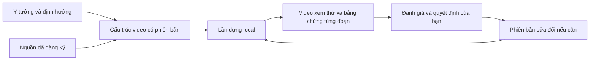

# Dựng video theo từng đoạn — phần đã triển khai

## 1. Bạn đã có gì?

PADStudio đã có thể lưu cấu trúc video theo phiên bản, dựng đúng phiên bản bằng công cụ local, so sánh thay đổi và dùng lại những đoạn còn khớp. Phần này mở rộng kho dữ liệu hiện có, không thêm cơ sở dữ liệu hay ép dự án đi qua các bước cố định.

| Tình huống | Hệ thống lưu | Bằng chứng kết quả |
| --- | --- | --- |
| Đã có tư liệu | Cấu trúc video, tham chiếu nguồn, kết quả dựng đúng phiên bản | MP4 xem được, file và ảnh từng đoạn, mã băm nguồn |
| Mới có ý tưởng | Mục đích từng đoạn, lời dẫn, phần còn thiếu tư liệu | Ngữ cảnh chỉ rõ chỗ thiếu; chưa đủ nguồn thì không dựng |
| Sửa bản đã duyệt | Phiên bản mới, giữ bản dựng và quyết định cũ | Dựng lại đoạn thay đổi, dùng lại đoạn khớp; bản mới cần đánh giá riêng |

Đây là một phần dựng video local đã hoàn thành. Tài liệu này mô tả contract `video.sequence` **1.0** và
cơ chế dựng/dùng lại đoạn, vẫn áp dụng cho mọi phiên bản. Bố cục nhiều lớp (lời đọc đặt trễ, chữ có style,
overlay, chuyển cảnh, nhạc, loudness) là `video.sequence` **1.1**, mô tả ở
[PHASE4-PRODUCTION-SPEC.md](PHASE4-PRODUCTION-SPEC.md); phân tích tư liệu nằm ở
[SOURCE-UNDERSTANDING-SPEC.md](SOURCE-UNDERSTANDING-SPEC.md). Dịch vụ tạo nội dung trả phí là khả năng riêng;
chat nằm ở Agent host bên ngoài theo kiến trúc đã chốt, không phải capability cần triển khai trong PADStudio.

## 2. Mô hình hoạt động



- **Sequence — cấu trúc video:** mô tả sản phẩm, gồm thứ tự đoạn, nguồn, thời lượng, lời dẫn và phụ đề.
- **Workflow — công việc:** mô tả việc cần làm và điều kiện chuyển sang xem xét, phê duyệt hoặc hoàn thành.
- **Artifact — bản ghi nội dung có phiên bản:** lưu cấu trúc và các tài liệu sáng tạo.
- **Result — kết quả công cụ:** lưu sản phẩm của một lần chạy cùng nguồn gốc của nó.

Dựng xong không tự chuyển workflow và không tự ghi quyết định thay bạn.

Từ OpenMontage, phần này học cách phân tách kịch bản, cảnh và ý đồ dựng; đánh giá dựa trên tham chiếu; quan sát kết quả trực quan. PADStudio giữ cơ chế phiên bản, quản lý đầu vào/đầu ra và lựa chọn công cụ của mình. Không mang sang thứ tự giai đoạn bắt buộc, kiểu cảnh phụ thuộc renderer, quy tắc thẩm mỹ cố định hay suy luận rằng có âm lượng là lời nói đã đúng.

## 3. Bản đồ kiểm soát

| Bạn muốn kiểm soát | Nơi kiểm soát hiện tại |
| --- | --- |
| Nội dung từng đoạn | `intent`, nguồn hình, lời dẫn, phụ đề và thời lượng trong sequence |
| Lý do và lịch sử sửa | `changeReason`, phiên bản bất biến, kiểm tra `expectedRevision` |
| Nguồn nào được sử dụng | ID nguồn/kết quả đã đăng ký; tham chiếu toàn video và từng đoạn |
| Công cụ nào chạy | Yêu cầu chạy ghi rõ `capability`, `tool`, `purpose` và phiên bản đầu vào |
| Đoạn nào dựng lại/dùng lại | Dấu vết từng đoạn; kiểm tra nội dung, nguồn và file bộ nhớ đệm |
| Kết quả nào được chấp nhận | Review và quyết định gắn đúng ID kết quả; không kế thừa duyệt tự động |
| Quan sát sản phẩm | Giao diện xem video, ảnh từng đoạn, cảnh báo và so sánh phiên bản |
| Thay đổi hành vi hệ thống | Các file mã nguồn trong bảng bên dưới và test tương ứng |

**Ranh giới hiện tại:** giao diện web chỉ quan sát và chọn cách xem. Việc ghi/sửa dữ liệu thực hiện qua Agent hoặc CLI; chưa có trình biên tập trực tiếp trên web. Dữ liệu dự án tiếp tục dùng cách lưu JSON hiện có.

### Mã nguồn liên quan

Các đường dẫn dưới đây tính từ thư mục gốc repository.

| Thành phần | File chính | Trách nhiệm |
| --- | --- | --- |
| Hợp đồng cấu trúc video | [video-sequence.js](../../src/production/video-sequence.js) | Chuẩn hóa, kiểm tra đoạn và so sánh cấu trúc |
| Lưu phiên bản | [project-intelligence-store.js](../../src/intelligence/project-intelligence-store.js) | Lưu artifact, kiểm tra phiên bản và đầu ra workflow |
| Phân tích ảnh hưởng | [production-context.js](../../src/production/production-context.js) | Tổng hợp phiên bản, nguồn thiếu và phụ thuộc thay đổi |
| Dựng video | [ffmpeg-sequence-renderer.js](../../src/tools/ffmpeg-sequence-renderer.js) | Dựng từng đoạn, dùng lại, ghép và kiểm tra kỹ thuật |
| Đăng ký công cụ | [default-tool-registry.js](../../src/execution/default-tool-registry.js) | Đưa renderer vào danh mục công cụ |
| Lưu kết quả | [project-store.js](../../src/project/project-store.js) | Ghi nguồn đầu vào và phiên bản artifact của kết quả |
| Lệnh ghi sequence | [write-video-sequence.js](../../src/cli/write-video-sequence.js) | Điểm vào CLI `project:sequence` |
| Giao diện quan sát | [production-view.js](../../ui/production-view.js) | Xem và so sánh các phiên bản |
| Kiểm thử | [video-sequence.test.js](../../test/video-sequence.test.js) | Kiểm tra dữ liệu, dựng thật, tái sử dụng và phục hồi lỗi |

## 4. Tạo cấu trúc video

Dùng `project:sequence`, hoặc `project:artifact` với `type: "video.sequence"`. Ví dụ nội dung yêu cầu; giữ nguyên tên trường kỹ thuật:

```json
{
  "key": "main-film",
  "name": "Video chính",
  "summary": "Mở đầu giới thiệu sản phẩm",
  "status": "active",
  "references": [],
  "data": {
    "version": "1.0",
    "changeReason": "Tạo cấu trúc ban đầu",
    "format": { "width": 1280, "height": 720, "fps": 25 },
    "segments": [
      {
        "id": "opening",
        "title": "Mở đầu",
        "intent": "Giới thiệu sản phẩm rõ ràng",
        "durationSeconds": 4,
        "visual": {
          "source": { "kind": "resource", "id": "resource-REPLACE" },
          "startSeconds": 0,
          "volume": 0.25
        },
        "narration": null,
        "captions": [
          { "text": "Giới thiệu sản phẩm", "startSeconds": 0.4, "endSeconds": 3.6 }
        ],
        "references": []
      }
    ]
  }
}
```

Thay ID mẫu bằng ID đã đăng ký. Nếu dùng một kết quả làm nguồn, khai báo `{ "kind": "result", "id": "result-...", "file": "primary" }`. Nguồn là thư mục cần thêm `itemPath`. Không nhận đường dẫn đầu vào/đầu ra tùy ý.

**Khi mới có ý tưởng:** `visual` có thể là `null`; lời dẫn có thể có `text` nhưng `source: null`. Renderer báo `missing_narration_audio` nếu chưa có âm thanh lời dẫn, không âm thầm bỏ lời nói.

**Khi đã có lời dẫn thu âm:** `narration` gồm `text`, `source`, tùy chọn `startSeconds` (vị trí lấy trong nguồn) và `volume` (mặc định 1). Với sequence 1.0, lời dẫn phát từ đầu đoạn; muốn đặt muộn hơn phải chuẩn bị nguồn có sẵn phần căn thời gian (sequence 1.1 có `offsetSeconds`/`durationSeconds` riêng). Âm thanh nguồn hình giữ mức `visual.volume`, mặc định 1. Sequence 1.0 không tự hạ âm nền; ducking cho nhạc và `volumeRanges` thuộc sequence 1.1.

**Giới hạn dữ liệu:**

- Mỗi đoạn có ID duy nhất, ổn định; từ 1–100 đoạn, mỗi đoạn 0,1–600 giây, tổng không quá một giờ.
- Thời lượng phải khớp số khung hình nguyên; chiều rộng/cao là số chẵn từ 64–3840; FPS nguyên từ 1–60.
- Phụ đề xếp theo thời gian, không chồng nhau và nằm trong đoạn.
- Trường không được hỗ trợ sẽ bị từ chối thay vì bỏ qua.

Các quy tắc này áp dụng cho loại artifact mới `video.sequence`. Artifact thông thường và dữ liệu dự án cũ vẫn đọc được.

## 5. Phiên bản và ảnh hưởng thay đổi

Khi ghi tiếp cùng `key`, phải gửi `expectedRevision` bằng phiên bản mới nhất đã lưu, kể cả bản nháp, cùng `data.changeReason` không rỗng. Dùng phiên bản cũ sẽ bị báo xung đột. Cơ chế này phát hiện dữ liệu sửa đã lỗi thời trong mô hình một bên ghi hiện có; chưa cung cấp giao dịch giữa nhiều tiến trình hoặc cộng tác chỉnh sửa đồng thời.

Trong mỗi project chỉ được có một `video.sequence` hiện hành, kể cả khi các sequence dùng key khác nhau. Ghi `status: active` cho key khác sẽ bị từ chối cho tới khi sequence hiện hành được `retired`. Bản `draft` mới nhất của một key được biểu diễn rõ là `candidate`: không thay thế current nhưng có thể render để so sánh. Các revision draft cũ hơn và bản `retired` là lịch sử.

Tham chiếu ở artifact áp dụng cho toàn video; tham chiếu và nguồn media trong đoạn chỉ thuộc đoạn đó. Kho dữ liệu kiểm tra cả hai phạm vi, ngữ cảnh suy ra các quan hệ phụ thuộc. Khi sửa, cần gửi tập tham chiếu hiện muốn dùng để tránh giữ nhầm nguồn đã bỏ.

**Ví dụ:** sửa phụ đề hoặc tham chiếu sáng tạo riêng đoạn B → B dựng lại; A có thể dùng lại nếu nội dung và nguồn vẫn khớp. Đổi tham chiếu toàn video có thể ảnh hưởng mọi đoạn.

`context.production` cung cấp các phiên bản, khác biệt từng đoạn, bản dựng và review/quyết định đúng kết quả. Các trường `artifactStates`, `resultStates`, `affectedWorkItems` chỉ ra phụ thuộc đã thay phiên bản, ngừng dùng hoặc thiếu media, kể cả ảnh hưởng gián tiếp. Đây là cảnh báo để xem xét; hệ thống không tự hủy quyết định sáng tạo hay xóa lịch sử.

Theo dõi phụ thuộc dựa trên ID đã đăng ký, chưa liên tục quét mã băm toàn bộ hệ thống file. Khi dựng, công cụ băm nội dung nguồn và từ chối nếu nguồn thay đổi giữa lần chạy. ID không đổi chưa đủ để cho phép dùng lại đoạn.

Công việc chuyển sang xem xét, phê duyệt hoặc hoàn thành phải có đầu ra khớp từng `expectedOutputs` về `kind` và `type` nếu đã khai báo. Workflow cũ vẫn đọc được; lần ghi tiếp phải đáp ứng kiểm tra này.

## 6. Dựng video và dùng lại đoạn

Ví dụ yêu cầu chạy công cụ:

```json
{
  "capability": "video.render-sequence",
  "tool": "ffmpeg-sequence",
  "purpose": "Xem thử phần mở đầu đã sửa",
  "inputs": {
    "artifactId": "artifact-...",
    "reuseResultId": "result-..."
  }
}
```

`reuseResultId` không bắt buộc. Kết quả được dùng lại phải thuộc cùng `key` sequence và phiên bản công cụ tương thích. Trước khi sao chép đoạn, renderer đối chiếu cấu trúc đoạn/định dạng đã chuẩn hóa, tham chiếu toàn video, mã băm SHA-256 của nguồn, phiên bản chương trình FFmpeg và mã băm file đệm. File sao chép được kiểm tra media và băm lại.

`reusedFrom` ở từng đoạn ghi nguồn gốc tái sử dụng; không làm bản mới phụ thuộc vào mọi quyết định sáng tạo của bản dựng cũ. Nguồn media thực sự nằm trong `inputResources`/`inputResults`; phiên bản sequence chính xác nằm trong `inputArtifacts`. Với kết quả cũ chưa có trường này, bộ đọc dùng `[]`.

Renderer thực hiện:

1. Căn ảnh/video vào khung hình, thêm viền nếu cần.
2. Trộn âm thanh nguồn và lời dẫn nếu có.
3. Ghi phụ đề văn bản trực tiếp lên hình.
4. Ghép nối các đoạn và kiểm tra đầu ra.

Không tự đổi sang renderer khác. Lời dẫn dài hơn đoạn bị từ chối; ngắn hơn thì được bù phần còn lại bằng im lặng. Khoảng lấy hình không hợp lệ gây lỗi trước khi đăng ký kết quả lâu dài.

Mặc định không dựng phiên bản lịch sử hoặc phiên bản có phụ thuộc đã thay đổi. Candidate mới nhất được dựng mà không cần giả làm lịch sử; Result ghi `sequenceRole: candidate`. `allowHistorical: true` chỉ dành cho lịch sử hoặc trường hợp chủ động chấp nhận phụ thuộc cũ, và Result đánh dấu `historical: true`.

Kết quả thành công đăng ký video chính, file từng đoạn và ảnh đại diện trong `outputs/run-id`. File trung gian được dọn; nếu thất bại, đầu ra chưa chốt được hoàn tác. Cơ chế phục hồi `finalization_pending` hiện có giữ file và hoàn tất ghi nhận lần chạy mà không dựng lại.

## 7. Đánh giá và quan sát

Kiểm tra kỹ thuật xác nhận file, luồng H.264/AAC, kích thước, FPS/số khung hình, âm thanh stereo 48 kHz, thời lượng và sự ổn định của nguồn. Renderer 1.2 còn lưu các khoảng digital silence dài ít nhất 0,25 giây, khoảng im lặng lớn nhất và đuôi im lặng; đây là evidence/cảnh báo, không tự kết luận im lặng là sai chủ ý.

Các mục `creativeReview`, `speechContentReview`, `subtitleVisualReview`, `audioMixReview` được ghi rõ là `not_performed` — chưa đánh giá. Ảnh đại diện là bằng chứng để xem, không chứng minh chất lượng sáng tạo đã đạt.

Agent ghi đánh giá đúng ID kết quả qua `project:review`, ghi phản hồi thực tế của bạn qua `project:decide`. Dùng lại đoạn không mang theo phê duyệt cho bản mới. Review cũ vẫn gắn với đối tượng ban đầu bất biến.

Giao diện hiển thị mục đích/thời lượng từng đoạn, media còn thiếu, ảnh đại diện, thay đổi, quyết định và hai khung so sánh phiên bản. Các điều khiển chỉ thay đổi cách xem. Khi trạng thái sản xuất không đổi, việc cập nhật dữ liệu định kỳ không khởi động lại trình phát.

## 8. Đã kiểm chứng và giới hạn tiếp theo

Đợt triển khai đã chạy **81 bài kiểm thử, đều đạt**, gồm kiểm thử hiện có và phần bổ sung. Các tình huống mới bao gồm: lập kế hoạch chưa có media, dữ liệu sai, xung đột phiên bản, thay đổi phụ thuộc, đầu ra workflow không khớp, dựng FFmpeg thật, dùng lại một phần, nguồn bị sửa, lời dẫn quá dài, hoàn tác, phục hồi lần chạy và HTTP chỉ đọc.

Đã kiểm tra giao diện trên Edge ở kích thước máy tính/điện thoại, so sánh hai phiên bản, giữ trình phát khi cập nhật định kỳ và hiển thị phụ đề tiếng Việt. Đây là kiểm chứng bằng dữ liệu thử; chưa phải đánh giá chất lượng cho mọi dự án thực tế. Không gọi dịch vụ trả phí.

Các khả năng có thể nghiên cứu tiếp: phân tích tư liệu, bố cục phong phú hơn, nhạc/căn thời gian từng đoạn hoặc vòng đời công cụ trả phí. Chưa mặc định chọn triển khai các phần đó. Mỗi phần cần mục tiêu và bằng chứng riêng; không biến mô hình này thành quy trình bắt buộc cho mọi dự án.
